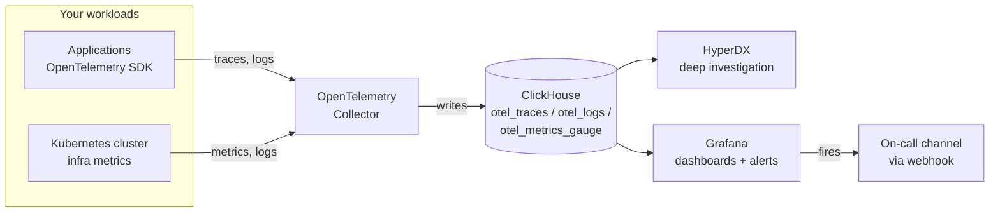

# ClickStack Grafana Dashboards

High-level Grafana dashboards that read the **same ClickHouse data** your HyperDX /
ClickStack deployment already stores. They give you executive-style "golden signal"
views over your services, Kubernetes cluster, and logs — no extra collectors or
schema changes required.

These complement the per-domain HyperDX dashboards in [`../hyperdx/dashboards/`](../hyperdx/dashboards/):
HyperDX for deep, interactive investigation; Grafana for at-a-glance health and for
teams that already standardize on Grafana.

> **Running ClickStack on Kubernetes?** Its bundled Grafana uses ephemeral storage, so
> UI/API imports vanish on the next pod restart. Use the durable ConfigMap-provisioning
> installer in [`kubernetes/`](kubernetes/README.md) — one command installs the data
> source, all four dashboards, and the alerts so they survive restarts.

---

## Customer quick-start (dashboards + alerts)

The two packages install through **different mechanisms**: dashboards import through the
UI in seconds; alert rules load from Grafana's provisioning folder and need a restart.
Follow these steps once and you'll have both.

> **Prerequisites:** a running Grafana (v10.4+), the
> [ClickHouse data source plugin](https://grafana.com/grafana/plugins/grafana-clickhouse-datasource/)
> installed, and network access from Grafana to the ClickHouse that ClickStack writes to.
> On **Grafana Cloud** (or anywhere you can't write to `/etc/grafana/provisioning`), see
> [Installing alerts without filesystem access](#installing-alerts-without-filesystem-access-grafana-cloud).

**1. Download the two folders** — `grafana/dashboards/` (4 JSON files) and
`grafana/alerting/` (3 YAML files).

**2. Add the ClickHouse data source** — *Connections → Data sources → Add → ClickHouse*.
Enter host/port/user/password/database. **Set its UID to `clickstack-ch`** (the *UID*
field). This is the one gotcha:
   - **Dashboards** use a datasource *variable* — you pick your connection on import, so
     the UID doesn't matter for them.
   - **Alert rules** reference a *fixed* UID (`clickstack-ch`) because provisioned rules
     can't prompt for one. So either name the UID `clickstack-ch`, **or** find/replace
     `clickstack-ch` in `alerting/alert-rules.yaml` with your datasource's UID.

**3. Import the dashboards (UI, no restart)** — for each JSON:
*Dashboards → New → Import → Upload JSON file →* pick your ClickHouse datasource →
**Import**. Repeat for all four.

**4. Configure the alerts *before* you install them (so you restart only once)** —
edit the two YAML files in `alerting/` on disk first:
   - In `alerting/contact-points.yaml`, replace the placeholder `url` with a
     webhook URL for the channel you want — a Slack incoming webhook, a Teams
     Workflow "Post to a channel when a webhook request is received" URL,
     PagerDuty, Discord, or any HTTP endpoint that accepts a POST.
   - (Optional) Adjust the `params: [...]` thresholds in `alerting/alert-rules.yaml`
     (see [alerting/README.md](alerting/README.md#tuning-thresholds)).

**5. Install the alerts (provisioning, one restart)** — copy `grafana/alerting/` onto
your Grafana server, mount/place it at `/etc/grafana/provisioning/alerting/`, then
restart Grafana once:
   ```yaml
   # docker-compose / Kubernetes volume mount example
   volumes:
     - ./alerting:/etc/grafana/provisioning/alerting
   ```
   Rules appear under **Alerting → Alert rules → "ClickStack Alerts"** (10 rules).
   Later threshold tweaks just need a `POST /api/admin/provisioning/alerting/reload`
   (no full restart).

**6. Verify** — dashboards show live data; every alert rule reports **health = ok**; and
*Contact points → ClickStack Alerts → Test* delivers a notification to your channel.

### Installing alerts without filesystem access (Grafana Cloud)

File-based provisioning needs write access to `/etc/grafana/provisioning/`, which Grafana
Cloud and some managed setups don't allow. In that case the **dashboards still import
normally** (step 3); for the **alerts**, use the Terraform provider instead — see
[`alerting/terraform/`](alerting/terraform/README.md) for a ready-to-apply example that
creates the same 10 rules, the alert contact point, and the notification policy via the
Grafana API.

---

## What's included

| File | Dashboard | Reads from | Answers |
|------|-----------|-----------|---------|
| `dashboards/executive-summary.json` | **Executive Summary** | all three | One-pane health across services, Kubernetes, and logs — top signals only. |
| `dashboards/service-health-golden-signals.json` | **Service Health (Golden Signals)** | `otel_traces` | Are my services up, fast, and error-free? (Rate / Errors / Duration per service) |
| `dashboards/kubernetes-cluster-overview.json` | **Kubernetes Cluster Overview** | `otel_metrics_gauge` | Are nodes/pods healthy? CPU, memory, restarts, deployment availability. |
| `dashboards/logs-errors-overview.json` | **Logs & Errors Overview** | `otel_logs` | How much are we logging, what's erroring, and what do the latest errors say? |

All four use only the **default OpenTelemetry ClickHouse schema** that ClickStack ships
with, so they work on any ClickStack / HyperDX + ClickHouse deployment.

**Filters:** the Service Health, Kubernetes, and Logs dashboards include a **Service** or
**Namespace** drop-down (multi-select, defaults to *All*) at the top, so you can narrow
every panel to the workloads you care about. The Executive Summary is intentionally
unfiltered — it's the always-on overview.

**Alerts:** a companion set of Grafana unified-alerting rules (error rate, latency,
SLO fast-burn, ingestion stalled, pods not running, container restarts, error/fatal
logs, collector drops, ClickHouse failed queries) lives in
[`alerting/`](alerting/README.md) — a generic webhook by default, tunable thresholds. Use these when
you want Grafana to *page you*, not just visualize.

---

## Will these light up? (data each dashboard needs)

Every dashboard reads only ClickStack's default OTel schema, but a panel is only as full as
the telemetry you actually send. Use this to predict what will have data before you import:

| Dashboard | Needs | Stays empty if… |
|-----------|-------|-----------------|
| **Executive Summary** | any of the signals below | nothing is flowing into ClickStack yet |
| **Service Health (Golden Signals)** | trace spans in `otel_traces` (apps instrumented with OTel tracing) | your services don't emit server spans |
| **Kubernetes Cluster Overview** | `otel_metrics_gauge` from the OTel **k8s cluster receiver** + **kubelet stats receiver** (ClickStack's infra collectors ship these) | those receivers aren't enabled or scraping |
| **Logs & Errors Overview** | log rows in `otel_logs` (container logs and/or app OTLP logs) | no log pipeline is wired up |

**Empty dashboard? quick checks**

1. **Is data flowing?** Confirm the dashboard's source table has recent rows — e.g. in HyperDX
   Search, or `SELECT count() FROM otel_traces WHERE Timestamp > now() - INTERVAL 15 MINUTE`.
2. **Right database?** These dashboards default to the `default` database via the hidden
   `database` variable — if your ClickStack uses another, set it (Dashboard settings → Variables).
3. **Widen the time range** — the default window is recent; stretch it if your data is sparse.
4. **Kubernetes panels empty specifically?** Verify the **k8s cluster** and **kubelet stats**
   receivers are enabled and scraping — those metrics don't exist without them.

---

## Architecture — how it fits together

**Collect once, use everywhere.** Your applications and Kubernetes cluster emit standard
OpenTelemetry data; ClickStack stores it in ClickHouse; Grafana and HyperDX both read from
that same store. Grafana is a **read-only consumer** of data ClickStack already stores — no
new agents, no schema changes, nothing changes in the collection pipeline.



Grafana and HyperDX are two lenses on that one data set:

| Layer | Tool | What it answers |
|-------|------|-----------------|
| **At-a-glance health + paging** | **Grafana** *(this folder)* | "Is everything healthy right now?" and "Tell me the moment it isn't." |
| **Investigation** | **HyperDX** ([`../hyperdx/`](../hyperdx/README.md)) | "Something is wrong — show me the traces, logs, and spans so I can find the root cause." |

Because everything relies only on ClickStack's **standard OpenTelemetry schema**, the same
dashboards and alerts work on any customer's cluster unchanged — with no vendor lock-in.

---

## Requirements

1. **Grafana 10.4+** (tested on 11.2).
2. The **ClickHouse data source plugin** (`grafana-clickhouse-datasource`), installed and
   configured to point at the ClickHouse that ClickStack writes to.
   ```bash
   grafana-cli plugins install grafana-clickhouse-datasource
   ```
   Or in Grafana Cloud / container: add it from **Connections → Add new connection → ClickHouse**.
3. Your ClickHouse contains the standard ClickStack tables in the `default` database:
   `otel_traces`, `otel_logs`, `otel_metrics_gauge` (this is the default — nothing to change).

> **Different database name?** These dashboards assume the `default` database, exposed as a
> hidden **`database`** dashboard variable. If your ClickStack instance uses another database,
> edit that one variable's value (Dashboard settings → Variables → `database`) instead of
> find/replacing the JSON.

---

## Dashboard-only import (no alerts)

> This is the dashboards half of the [Customer quick-start](#customer-quick-start-dashboards--alerts)
> above — use it if you only want the boards and not the alert rules.

1. In Grafana, go to **Dashboards → New → Import**.
2. Upload one of the JSON files from `dashboards/` (or paste its contents).
3. When prompted, the dashboard exposes a **"ClickHouse datasource"** variable at the top —
   pick your ClickHouse connection. That's the only wiring step; every panel follows it.
4. Repeat for the other three dashboards.

No panel is hard-wired to a specific data source — they all reference a dashboard
**datasource variable** (`${clickhouseDatasource}`) and a hidden **`database`** variable, so the
same file works in any environment.

### Optional: provision them (GitOps)

Drop the JSON into a Grafana dashboard provisioning folder and point a provider at it:

```yaml
# /etc/grafana/provisioning/dashboards/clickstack.yaml
apiVersion: 1
providers:
  - name: ClickStack
    type: file
    options:
      path: /var/lib/grafana/dashboards/clickstack
```

---

## Screenshots

Captured against a live ClickStack cluster — this is what lands after you import. Click any
image for full size.

**Executive Summary** — the one-pane health wall:

[](screenshots/exec-summary.png)

<table>
<tr>
<td width="50%"><b>Service Health — Golden Signals</b><br><a href="screenshots/service-health.png"></a></td>
<td width="50%"><b>Kubernetes Cluster Overview</b><br><a href="screenshots/kubernetes-overview.png"></a></td>
</tr>
<tr>
<td width="50%"><b>Logs & Errors Overview</b><br><a href="screenshots/logs-overview.png"></a></td>
<td width="50%"><b>Alert rules (provisioned, live)</b><br><a href="screenshots/alert-rules.png"></a></td>
</tr>
</table>

---

## Dashboard details

### Executive Summary (all three sources)
- **Services:** requests/sec, error rate %, latency p95, services-seen count; request-volume
  and overall error-rate trends.
- **Kubernetes:** Nodes Ready, Pods Running, Pods Not Running, container restarts (in range).
- **Logs:** logs/sec, error+ logs/sec, error log %, fatal count; volume-by-severity and
  error-by-service trends.
- **Needs attention:** every service ranked by error rate, color-coded.
- **ClickStack platform:** the pipeline's own health — OTel collector refused/sec, export
  failures, exporter queue used %, ingest accepted/sec; ClickHouse failed queries/sec,
  running queries, memory tracked, disk free %; plus throughput and query/failure trends.
- *A single at-a-glance page for status pages, war-rooms, or a leadership screen. No filters.*

### Service Health — Golden Signals (`otel_traces`)
- **Filter:** `Service` (multi-select, default All).
- **Stats:** requests/sec, error rate %, latency p95, and a **Services < SLO (99.9%)** count
  (all over the whole selected range).
- **Timeseries:** request volume by service, latency percentiles (p50/p95/p99),
  overall error rate, errors per interval by service.
- **Tables:** per-service RED breakdown (Req/s, Errors, Error %, p50/p95/p99) with a
  color-coded Error % column; and a **Service SLO & error-budget burn** table
  (availability %, budget left %, burn rate — burn rate ≥14.4 is page-worthy).
- *Only inbound "server" spans are counted (`SpanKind = 'Server'`), so numbers reflect
  requests the service handled — not every internal/outbound span.*

### Kubernetes Cluster Overview (`otel_metrics_gauge`)
- **Filter:** `Namespace` (multi-select, default All) — applies to pod/deployment/container
  panels; node-level panels always show the whole cluster.
- **Stats:** Nodes Ready, Pods Running, Pods Not Running (excludes completed `Succeeded`
  Job pods), container restarts **in the selected range**.
- **Timeseries:** node CPU (cores), node memory (IEC bytes), top 10 pods by CPU,
  deployment availability % (available/desired replicas).
- **Tables:** top pods by working-set memory, container restarts in range by pod (color-coded).
- *Requires the OpenTelemetry **k8s cluster receiver** + **kubelet stats receiver**
  (ClickStack's infrastructure collectors ship these). Pod phase `2` = Running, `3` = Succeeded.*
- **Restart counts are windowed.** `k8s.container.restarts` is a cumulative lifetime
  counter, so the restart stat/table/alert report the **delta over the selected time
  range** (`max − min` per container), not the lifetime total — a container that
  restarted long ago but is now stable shows `0`.

### Logs & Errors Overview (`otel_logs`)
- **Filter:** `Service` (multi-select, default All).
- **Stats:** logs/sec, error+fatal logs/sec, error log %, fatal log count.
- **Timeseries:** log volume by normalized severity, error+ logs by service.
- **Tables:** top services by error logs, most recent errors (with message body).
- *"Error+" means `SeverityNumber >= 17` (error/fatal), falling back to lowercased
  `SeverityText` — robust to pipelines that set only the number or only the text.
  Severity charts group by a normalized bucket, so `info`/`information` and
  `ERROR`/`error` each collapse to one series. Includes both Kubernetes container
  logs and application OTLP logs, exactly as ClickStack ingests them.*

---

## Glossary

| Term | Meaning |
|------|---------|
| **ClickStack** | The telemetry stack (HyperDX + OpenTelemetry + ClickHouse) that collects and stores your observability data. |
| **ClickHouse** | The high-performance database where all telemetry is stored. |
| **OpenTelemetry (OTel)** | The vendor-neutral standard for collecting traces, logs, and metrics. |
| **Golden Signals / RED** | Rate, Errors, Duration — the standard way to measure service health. |
| **p95 / p99 latency** | The response time under which 95% / 99% of requests complete; better than an average for spotting slow outliers. |
| **Span / trace** | A single unit of work (span) and the end-to-end path of a request (trace). |
| **Contact point** | Where Grafana sends a notification (a webhook, email, Slack, etc.). |
| **Provisioning** | Configuring Grafana from files on disk rather than clicking through the UI. |

---

## Local development harness (maintainers only)

Authoring or validating these dashboards? The throwaway dev Grafana, the
`gen-dashboards.js` generator, and `validate.js` are documented in
[`../CONTRIBUTING.md`](../CONTRIBUTING.md). **Customers do not need any of this** to
import and use the dashboards.
