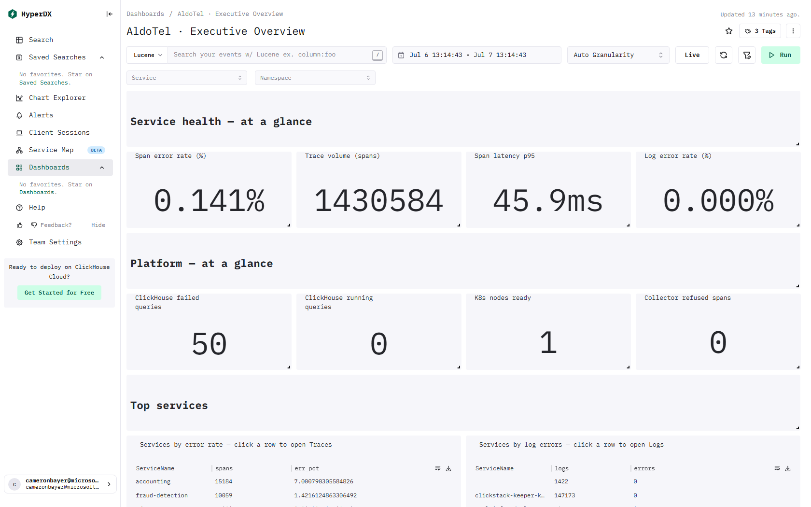
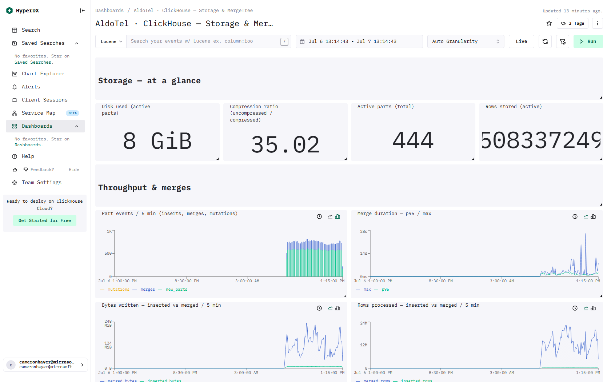
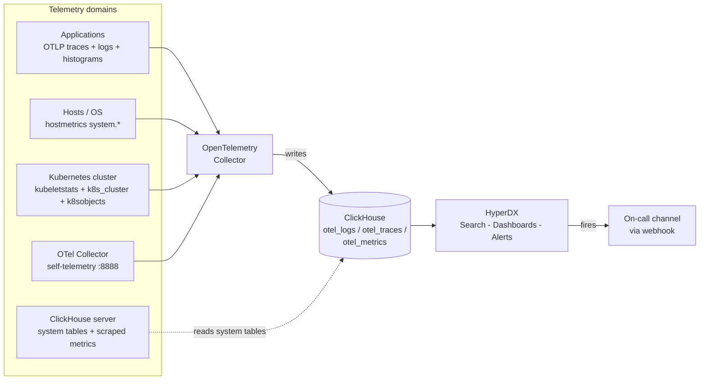

# ClickStack Dashboard Templates (Open Source / self-hosted HyperDX)

Download-and-go HyperDX dashboards for customers running **Open Source ClickStack**
(HyperDX + ClickHouse + OpenTelemetry). Each domain is a separate dashboard so customers
enable only what they run.

## Import in ~5 minutes

**PowerShell (Windows):**

```powershell
# 1. Get the templates
git clone https://github.com/Cameron-Bayer/AldoTel-Templates.git
cd AldoTel-Templates/hyperdx

# 2. Point at your HyperDX API (Team Settings → API Keys → Personal API Access Key)
$env:HDX_API_URL = "http://localhost:8000"
$env:HDX_API_KEY = "<your Personal API Access Key>"

# 3. Check what has data, then import
./preflight.ps1       # rates each dashboard OK/DEGRADED/FAIL
./import.ps1          # upserts the default dashboards (idempotent)
./import.ps1 -Advanced   # also import the advanced/ deep dives (optional data sources)
```

**bash (macOS / Linux):**

```bash
# 1. Get the templates
git clone https://github.com/Cameron-Bayer/AldoTel-Templates.git
cd AldoTel-Templates/hyperdx

# 2. Point at your HyperDX API (Team Settings → API Keys → Personal API Access Key)
export HDX_API_URL="http://localhost:8000"
export HDX_API_KEY="<your Personal API Access Key>"

# 3. Check what has data, then import
./preflight.sh        # rates each dashboard OK/DEGRADED/FAIL
./import.sh           # upserts the default dashboards (idempotent)
./import.sh --advanced   # also import the advanced/ deep dives (optional data sources)
```

Prefer a subset? `./import.sh --only services-red.json,logs-overview.json`. The **default**
import covers the dashboards that populate on a standard appliance deploy; the **advanced/**
tier (`--advanced`) adds deep dives that need optional data sources (ClickHouse metrics,
collector self-telemetry, or OTLP histograms). Full details, flags, and prerequisites are in
[Install](#install) below.

> 📖 **New here? Start with the [Dashboard Catalog & Field Guide](DASHBOARD-CATALOG.md)** — a
> plain-language, per-dashboard breakdown of what each one is for, why you'd use it, exactly what
> telemetry it needs, and how to read it. It also groups the dashboards into **setup tiers** so you
> know which work with zero setup vs. which need a collector receiver or app instrumentation.
>
> 🔍 **Want to go deeper?** The [Dashboard Deep-Dive](DASHBOARD-DEEP-DIVE.md) walks through every
> dashboard tile-by-tile in a Q&A format — what each visual shows, how to read it, and what to do
> when it lights up.
>
> 📄 **Per-dashboard reference pages** (auto-generated, optional) live in [`docs/`](docs/) — one page
> per dashboard with a screenshot and every tile's query. Handy for lookups; not needed to install.

**Default dashboards** (`dashboards/` — import these first; populated on a standard appliance deploy):

| File | What it shows | Source kind |
|------|---------------|-------------|
| `dashboards/executive-overview.json` | One landing page: cross-domain KPI tiles (server-span/log error %, p95, nodes ready) + **click-through** tables (services → Traces / Logs) + request/error trends | trace + log + metric |
| `dashboards/services-red.json` | RED method: request rate, error rate %, p50/p95/p99 latency, slowest routes, latency heatmap — plus a folded-in **SLO strip** (availability SLI, error budget, multi-window burn rate 1h/6h/24h/3d) | trace |
| `dashboards/logs-overview.json` | Log volume by severity, error rate, normalized error signatures, **new** error patterns, error sources by namespace/pod, live error stream | log |
| `dashboards/kubernetes-infrastructure.json` | Node CPU/mem, deployment availability, pod **count** by phase, restarts, saturation, top pod memory, node filesystem usage — plus **container-vs-limit** CPU/memory utilization and **cluster events** (Warnings, top reasons, live stream) | metric + log |
| `dashboards/host-os.json` | **Host / OS:** CPU busy %, load average, memory & swap used %, disk & network throughput, and a per-host summary table — from the `hostmetrics` receiver | metric |

**Advanced dashboards** (`dashboards/advanced/` — opt-in with `--advanced`; each needs an
**optional data source** that a standard appliance deploy does not ingest by default):

| File | What it shows | Needs |
|------|---------------|-------|
| `dashboards/advanced/collector-health.json` | OTel Collector pipeline: accepted/refused/failed spans & metric points, exporter queue utilization & sent, processor in/out (drops), scraper errors, collector CPU/mem | collector `:8888` self-telemetry scraped back into OTel |
| `dashboards/advanced/clickhouse-health.json` | **ClickHouse — Operations:** query/insert rate, failed queries, memory tracking, merges/mutations, running queries, disk free %, active merges, pending mutations | ClickHouse `:9363` metrics scraped into OTel (+ Raw SQL on `system.*`) |
| `dashboards/advanced/metrics-histograms.json` | **Latency histograms:** p50/p95/p99/avg for HTTP server/client + RPC server calls (bucket-interpolated), avg-latency & request-rate trends, and ClickHouse Keeper latency | app OTLP **explicit-bucket histogram** metrics (`http.*.duration` / `rpc.*.duration`) |
| `dashboards/advanced/clickhouse-queryperf.json` | Query rate by kind, p95/p99 duration, memory/query, exceptions, slowest queries, top error codes (`system.query_log` + metrics) | ClickHouse metrics and/or Raw SQL access |
| `dashboards/advanced/clickhouse-storage-mergetree.json` | MergeTree storage: disk & compression KPIs, part-events / merge-duration / bytes & rows over time, largest tables, too-many-parts watch, recent merges (`system.parts` / `system.part_log`) | Raw SQL access to `system.*` |
| `dashboards/advanced/clickhouse-keeper-replication.json` | ClickHouse Keeper: sessions, watches, request rate by type, commits vs failed, packets, in-flight, commit/process time, Keeper errors; plus replication status & queue tables (empty on single-node, populate when replicated) | ClickHouse metrics and/or Raw SQL access |

## Screenshots

Captured against a live **open-source ClickStack** (HyperDX 2.27) with the OpenTelemetry
demo app flowing — this is what lands after you run `import`. Click any image for full size.

**Executive Overview** — the cross-domain landing page:

[](docs/images/executive-overview.png)

<table>
<tr>
<td width="50%"><b>Services — RED (Rate / Errors / Duration)</b><br><a href="docs/images/services-red.png"></a></td>
<td width="50%"><b>Logs — Overview</b><br><a href="docs/images/logs-overview.png"></a></td>
</tr>
<tr>
<td width="50%"><b>Kubernetes — Infrastructure</b><br><a href="docs/images/kubernetes-infrastructure.png"></a></td>
<td width="50%"><b>OTel Collector — Pipeline Health</b><br><a href="docs/images/collector-health.png"></a></td>
</tr>
<tr>
<td width="50%"><b>ClickHouse — Operations</b><br><a href="docs/images/clickhouse-health.png"></a></td>
<td width="50%"><b>ClickHouse — Query Performance & Errors <sub>(advanced)</sub></b><br><a href="docs/images/clickhouse-queryperf.png"></a></td>
</tr>
<tr>
<td width="50%"><b>ClickHouse — Storage & MergeTree <sub>(advanced)</sub></b><br><a href="docs/images/clickhouse-storage-mergetree.png"></a></td>
<td width="50%"><b>ClickHouse — Keeper & Replication <sub>(advanced)</sub></b><br><a href="docs/images/clickhouse-keeper-replication.png"></a></td>
</tr>
</table>

## Architecture — how it fits together

**Collect once, use everywhere.** Your applications, Kubernetes cluster, the OpenTelemetry
Collector, and ClickHouse all emit telemetry that lands in ClickHouse. HyperDX reads it back
for search, dashboards, and alerting — a **read-only consumer** of data ClickStack already
stores, so there's no extra collection cost or risk.



HyperDX and Grafana are two lenses on that one data set:

| Layer | Tool | What it answers |
|-------|------|-----------------|
| **Investigation** | **HyperDX** *(this folder)* | "Something is wrong — show me the traces, logs, and spans so I can find the root cause." |
| **At-a-glance health + paging** | **Grafana** ([`../grafana/`](../grafana/README.md)) | "Is everything healthy right now?" and "Tell me the moment it isn't." |

Because every tile relies only on ClickStack's **standard OpenTelemetry schema**, the same
dashboards work on any customer's cluster unchanged — symptom-to-root-cause in one click, with
no vendor lock-in.

## Why these "just work": the schema contract

A HyperDX dashboard does not contain data — every tile points at a **Source** (Logs / Traces /
Metrics) which maps to **ClickHouse tables and column names**. Templates are portable only when
everyone lands data in the **standard ClickStack OTel schema** (`otel_logs`, `otel_traces`,
`otel_metrics_gauge/sum/histogram`). That is exactly what the default ClickStack OTel collector
produces, so ship the collector config alongside these dashboards as the contract.

The one thing that differs per install is the **Source IDs / connection ID / database name**.
The importer resolves those at install time, so the JSON stays portable.

## Prerequisites

1. A running OSS ClickStack with the three default sources created in HyperDX:
   a **Logs** (kind `log`), **Traces** (kind `trace`), and **Metrics** (kind `metric`) source.
2. Telemetry flowing in via the standard OTel collector:
   - ClickHouse metrics (Prometheus/system metrics) for `clickhouse-health`
   - `kubeletstats` + `k8s_cluster` receivers for `kubernetes-infrastructure` (add `k8sobjects` for its cluster-events tiles)
   - `hostmetrics` receiver (`system.*`) for `host-os`
   - app OTLP **histogram** metrics (`http.*.duration` / `rpc.*.duration`) for `metrics-histograms`
   - app traces + logs for `services-red` / `logs-overview`
3. A **Personal API Access Key**: HyperDX → **Team Settings → API Keys**.

## Install

> **Run the pre-flight check first.** It queries your live install and tells you which dashboards
> have data flowing (so you don't import a dashboard that renders empty). See
> [Pre-flight](#pre-flight-will-it-work-here) below.

### 0. Get the templates

```bash
git clone https://github.com/Cameron-Bayer/AldoTel-Templates.git
cd AldoTel-Templates/hyperdx
```

> Or grab a pinned release from the [Releases](https://github.com/Cameron-Bayer/AldoTel-Templates/releases)
> page / **Code → Download ZIP**. If your HyperDX API isn't already reachable, port-forward it first:
> `kubectl port-forward -n clickstack svc/clickstack-app 8000:8000`.

### Windows (PowerShell)
```powershell
$env:HDX_API_URL = "http://localhost:8000"
$env:HDX_API_KEY = "<your Personal API Access Key>"
./preflight.ps1            # check compatibility (recommended)
./import.ps1               # upsert all dashboards
```

### macOS / Linux (bash, needs `curl` + `jq`)
```bash
export HDX_API_URL="http://localhost:8000"
export HDX_API_KEY="<your Personal API Access Key>"
./preflight.sh            # check compatibility (recommended)
./import.sh              # upsert all dashboards
```

The importer:
1. `GET /api/v2/sources` → picks source IDs by `kind`, plus the ClickHouse `connection` id and
   database/table names.
2. Substitutes the `{{TOKENS}}` in each template.
3. **Upserts** each dashboard: it matches an existing copy by the stable `tmpl:<slug>` tag and
   updates it in place (`PUT`); otherwise it creates a new one (`POST`). Re-running is therefore
   idempotent — no duplicates.

### Importer flags (same on PowerShell `-Flag` and bash `--flag`)

| Flag | Effect |
|------|--------|
| `-DryRun` / `--dry-run` | Print what would be created/updated/deleted; write nothing. |
| `-Only <files>` / `--only <files>` | Comma-separated file names to act on (e.g. `services-red.json,logs-overview.json`). |
| `-Delete` / `--delete` | Remove the template-managed dashboards (matched by `tmpl:` tag). |
| `-Duplicate` / `--duplicate` | Force-create new copies even if a matching dashboard exists. |

```powershell
./import.ps1 -DryRun
./import.ps1 -Only services-red.json,logs-overview.json
./import.ps1 -Delete
```

## Pre-flight: will it work here?

`preflight.ps1` / `preflight.sh` reads `requirements.json` and, for every metric/field a dashboard
needs, runs a lightweight `POST /api/v2/charts/series` query against your install to see whether
data is actually flowing. Each dashboard is rated:

- **OK** — all required *and* optional checks have data.
- **DEGRADED** — all required checks pass; some optional tiles will be empty.
- **FAIL** — a required check has no data; don't import as-is (your collector isn't sending it).

It then prints a `--only` command listing the dashboards whose **OTel source data** is present.

> **Scope — what preflight does and does not check.** Preflight verifies only that the
> **OTel telemetry** each dashboard reads (metrics / traces / logs) is flowing. It does **not**
> validate ClickHouse **Raw SQL** access. The Raw-SQL dashboards — `clickhouse-storage-mergetree`
> (all tiles) and the `system.query_log` tiles of `clickhouse-queryperf` — additionally need the
> HyperDX ClickHouse connection user to be able to `SELECT` from the relevant `system.*` tables
> (`system.parts`, `system.part_log`, `system.query_log`, with `part_log` / `query_log` enabled).
> Preflight can't see those permissions, so a Raw-SQL dashboard it lists may still render empty if
> the connection user lacks `SELECT` on those tables. See the per-dashboard `receivers` notes in
> [`requirements.json`](./requirements.json) / the [Support matrix](#support-matrix) below.

## Alerts pack

Optional bundle of importable **alert** definitions in [`alerts/`](alerts/README.md) — one per
high-level signal (services error rate, SLO fast burn, collector drops, ClickHouse too-many-parts,
replication lag). Each binds to a dashboard tile and notifies a channel (a generic webhook you point
at your on-call system) when a threshold is breached. Portable and idempotent like the dashboards.

```powershell
# import dashboards first, then:
./import-alerts.ps1 -DryRun                     # preview
./import-alerts.ps1                             # upsert (reuses a webhook named "ClickStack Alerts")
# first-time channel setup (creates the webhook):
$env:HDX_EMAIL="you@corp.com"; $env:HDX_PASS="***"; $env:HDX_APP_URL="http://localhost:3000"
./import-alerts.ps1 -WebhookUrl "https://your-webhook-endpoint.example/hooks/xxxx"
```

Thresholds are opinionated defaults, tunable per install. See [`alerts/README.md`](alerts/README.md)
for the full signal table, channel setup, and tuning notes.

## Grafana dashboards

Prefer Grafana, or want a high-level/executive view? [`../grafana/`](../grafana/README.md) contains six
importable Grafana dashboards that read the **same ClickHouse data** — no extra collectors or schema
changes. They use the [ClickHouse data source](https://grafana.com/grafana/plugins/grafana-clickhouse-datasource/)
and a portable **datasource variable**, so on import you just pick your ClickHouse connection:

- **Executive Summary** — one pane combining top signals across services, Kubernetes, and logs.
- **Service Health (Golden Signals)** — RED metrics per service from `otel_traces`.
- **Kubernetes Cluster Overview** — nodes, pods, CPU/memory, restarts, container-vs-limit utilization, and cluster events.
- **Logs & Errors Overview** — volume by severity, error rate, and recent errors from `otel_logs`.
- **Host / OS Metrics** — CPU, load, memory/swap, and disk/network I/O per host from `system.*`.
- **Latency Histograms** — average latency and request rate from `otel_metrics_histogram`.

The service/Kubernetes/logs/host/latency boards include **Service / Namespace / Host filter dropdowns**. See
[`../grafana/README.md`](../grafana/README.md) for customer quick-start and import steps.

**Grafana alerts:** the [`../grafana/alerting/`](../grafana/alerting/README.md) folder adds six
provisioned Grafana unified-alerting rules over the same ClickHouse data (service error
rate, p95 latency, trace ingestion stalled, pods not Running, error-log rate, fatal logs) —
a generic webhook by default, tunable thresholds. This is the Grafana-native counterpart to
the HyperDX [Alerts pack](#alerts-pack) above: use HyperDX to investigate, Grafana to page.

## Support matrix

What each dashboard needs from your OpenTelemetry collector. **Required** checks must have data or
the dashboard is rated FAIL; **optional** tiles degrade gracefully (render empty) when absent.
Authoritative, machine-readable version: [`requirements.json`](./requirements.json).

| Dashboard | Source kind | Required receivers / signals | Optional (degrades) |
|-----------|-------------|------------------------------|---------------------|
| `clickhouse-health` — Operations | metric + SQL | ClickHouse metrics scraped into OTel — `ClickHouseProfileEvents_{Query,FailedQuery,SelectQuery,InsertQuery}` (sum), `ClickHouseMetrics_{Query,MemoryTracking}` (gauge) | `*_InsertedRows`, `ClickHouseMetrics_{Merge,PartMutation}`; Raw SQL on `system.disks` / `system.merges` / `system.mutations` powers the disk-free %, active-merges and pending-mutations tiles |
| `kubernetes-infrastructure` | metric + log | `kubeletstats` + `k8s_cluster` receivers — `k8s.node.{cpu,memory}.usage`, `k8s.deployment.{available,desired}`, `k8s.pod.{phase,memory.usage}`, `k8s.container.restarts` | `k8s.node.filesystem.{usage,capacity}`; container-vs-limit tiles use `k8s.container.{cpu,memory}_limit_utilization` + `container.uptime`; cluster-events tiles need the `k8sobjects` receiver (`ScopeName:*k8sobjectsreceiver*` in `otel_logs`) |
| `services-red` | trace | Application traces (OTLP) — server spans (`SpanKind:Server`) | error spans (`StatusCode:Error`) |
| `logs-overview` | log | Application/container logs (filelog or OTLP) — any log volume | error logs (`SeverityNumber>=17` or `SeverityText:error/fatal`) |
| `collector-health` | metric | OTel Collector self-telemetry scraped into OTel (Prometheus receiver on the collector's `:8888`) — `otelcol_receiver_accepted_spans_total`, `otelcol_exporter_{sent_spans_total,queue_size,queue_capacity}` | processor in/out items, scraper points, collector CPU/mem |
| `clickhouse-queryperf` _(advanced)_ | metric + SQL | `ClickHouseMetrics_{Query,MemoryTracking}` (gauge) **and** Raw SQL on `system.query_log` — the HyperDX ClickHouse user (`app` here) must be able to `SELECT` from `system.query_log`, and `query_log` must be enabled | `ClickHouseProfileEvents_FailedQuery`; error-code table reads `<metrics_db>.otel_metrics_sum` |
| `clickhouse-storage-mergetree` _(advanced)_ | SQL only | Raw SQL on `system.parts` + `system.part_log` — the HyperDX ClickHouse user (`app` here) must be able to `SELECT` from them (`part_log` is on by default). No metric receivers required. | — (all tiles are Raw SQL) |
| `clickhouse-keeper-replication` _(advanced)_ | metric + SQL | None hard-required (degrades). Keeper tiles use `ClickHouseMetrics_ZooKeeper*`/`Keeper*` + `ClickHouseProfileEvents_Keeper*` if scraped | Keeper metrics; **replication tables** (`system.replicas` / `system.replication_queue`) are empty on single-node and populate only on replicated/clustered installs |
| `executive-overview` | trace + log + metric | None hard-required — cross-cutting roll-up; every tile degrades when its signal is absent | traces (error %, p95, drill-down), logs (error %, drill-down), CH metrics, collector metrics |
| `host-os` | metric | `hostmetrics` receiver — `system.cpu.utilization`, `system.memory.utilization` (gauge) | `system.cpu.load_average.1m`, `system.swap.utilization`, `system.disk.io`, `system.network.io` |
| `metrics-histograms` | metric | Application OTLP explicit-bucket histograms — `http.server.duration` (histogram) | `http.client.duration`, `rpc.server.duration`, `ClickHouseHistogramMetrics_keeper_response_time_ms` |

**Baseline requirements (all dashboards):** HyperDX **≥ 2.27** (v2 dashboard API), the three
default sources created in HyperDX (`log` / `trace` / `metric`), and data landed in the standard
ClickStack OTel schema (`otel_logs`, `otel_traces`, `otel_metrics_{gauge,sum,histogram}`).

> Metric names vary by collector config. The names above are the defaults verified against a live
> OSS ClickStack; if `preflight` reports a required metric missing, your exporter likely emits it
> under a different name — check the metric names your collector actually produces (in ClickHouse:
> `SELECT DISTINCT MetricName FROM otel_metrics_gauge`), then adjust `metricName` in the tile (and
> `requirements.json`).

## Dashboard filters (variables)

Every dashboard ships a top-of-page **filter bar** (`filters[]`) so one template serves a busy
multi-tenant cluster without editing tiles. Pick a value and all tiles bound to that source
re-scope. What each exposes:

- **Service** — `services-red`, `logs-overview`, `executive-overview`.
- **Namespace** — `kubernetes-infrastructure`, `executive-overview`.
- **Collector** — `collector-health` (`service.instance.id`).
- **Severity** — `logs-overview`.

> Filters bind to one source. On the cross-source `executive-overview`, the **Service** filter scopes the
> trace tiles and **Namespace** scopes the metric tiles; tiles from other sources are unaffected.

## Customizing

- **Metric names depend on how ClickHouse exposes metrics.** The `clickhouse-health` tiles use
  the common `ClickHouseProfileEvents_*` / `ClickHouseMetrics_*` / `ClickHouseAsyncMetrics_*`
  names. If you scrape via a different exporter, adjust `metricName` in the tiles.
- Grid is **24 columns wide**; tiles use `x,y,w,h`.
- `aggFn` options: `count`, `sum`, `avg`, `min`, `max`, `quantile` (needs `level`),
  `count_distinct`, `last_value`.
- Number tiles support conditional coloring via `colorRules`
  (operators `gt/gte/lt/lte`, palette tokens like `chart-error`, `chart-warning`).

## Advanced SQL / anomaly-detection tiles (Raw SQL)

Several tiles use the **Raw SQL** variant (`configType: "sql"`) to go beyond static charts:

- **`services-red` → latency anomaly:** plots p95 latency against a **causal rolling baseline
  with ±3σ control bands** (trailing ~24h window that ends 1h before each point), so a spike is
  flagged relative to its own recent baseline rather than a static threshold — and an in-progress
  incident can't poison the baseline it's measured against.
- **`logs-overview` → new log patterns:** normalizes error bodies (digits/IDs → placeholders) and
  surfaces patterns that appeared in the **last 24h but never in the prior 7 days** — a cheap
  Drain-style "what's new since the deploy?" detector.
- **`services-red` → SLO strip:** a folded-in Availability (SLI) number, Error-budget-remaining
  number, and a **multi-window burn-rate** table over 1h/6h/24h/3d windows against a 99.9% SLO
  (`>1` = burning budget too fast) — the reliability view that used to be a separate dashboard.
- **`clickhouse-queryperf` _(advanced)_ → `system.query_log`:** query rate by kind, p95/p99 duration, peak
  memory per query, exceptions, and a slowest-queries table — read directly from ClickHouse's own
  `system.query_log` (requires the HyperDX ClickHouse user to have `SELECT` on it).
- **`clickhouse-storage-mergetree` _(advanced)_ → `system.parts` / `system.part_log`:** live disk & compression KPIs, part-event /
  merge-duration / bytes & rows time series, largest-tables and **too-many-parts** watch tables, and
  a recent-merges audit — read straight from ClickHouse's own storage system tables (no metrics
  pipeline needed).
- **All builder tables over Logs/Traces → click-through drill-downs:** table tiles use tile
  `onClick` (table-only) to link a clicked row straight into the **Traces** or **Logs** search,
  pre-filtered from the row — turning every table into a triage launcher:
  - `executive-overview`: services → Traces / Logs (`ServiceName = '{{ServiceName}}'`).
  - `services-red`: slowest routes → Traces (`SpanAttributes['http.route'] = '{{...}}'`); SLO burn-rate → Traces.
  - `logs-overview`: top error messages → Logs (`Body = '{{Body}}'`).

Both run entirely as ClickHouse SQL — no extra service. Other easy extensions:
disk-fill forecasting (linear fit on disk growth), `compareToPreviousPeriod: true` for instant
week-over-week baselining (already enabled on the ClickHouse query-rate tile), and SLO
error-budget burn-rate tiles.

## Glossary

| Term | Meaning |
|------|---------|
| **ClickStack** | The telemetry stack (HyperDX + OpenTelemetry + ClickHouse) that collects and stores your observability data. |
| **HyperDX** | The observability UI for searching telemetry and building dashboards/alerts on ClickHouse. |
| **ClickHouse** | The high-performance database where all telemetry is stored. |
| **OpenTelemetry (OTel)** | The vendor-neutral standard for collecting traces, logs, and metrics. |
| **OTel Collector** | The agent that receives telemetry and writes it to ClickHouse; also emits its own health metrics. |
| **RED method** | Rate, Errors, Duration — the standard way to measure service health. |
| **SLO / error budget / burn rate** | A reliability target, how much failure you can still absorb, and how fast you're consuming it. |
| **p95 / p99** | The value under which 95% / 99% of measurements fall — better than an average for spotting outliers. |
| **Span / trace** | A single unit of work (span) and the end-to-end path of a request (trace). |
| **MergeTree / parts** | ClickHouse's storage engine and its on-disk data fragments; too many parts is a common failure mode. |
| **Keeper** | ClickHouse's consensus/coordination service that keeps replicas in sync. |
| **Webhook** | A URL HyperDX posts to when an alert fires (your on-call channel's endpoint). |

## Notes

- **Credentials** — the API key and any webhook URL are environment secrets; keep them out of
  version control.
- **HTTP-oriented tiles degrade on non-HTTP services.** `services-red`'s route tiles read
  `SpanAttributes['http.route']` and `StatusMessage`; pure gRPC/messaging services that don't set
  those will show empty/`(none)` rows there while the rate/error/latency tiles still work.
- The importer **upserts** (matches by the `tmpl:<slug>` tag), so re-running updates dashboards in
  place instead of duplicating them. Use `-Delete` / `--delete` to remove them, or
  `-Duplicate` / `--duplicate` to force new copies.

## Maintainers

Regenerating the reference docs, the HyperDX v2 API details, and other maintainer
workflows are documented in [`../CONTRIBUTING.md`](../CONTRIBUTING.md).
