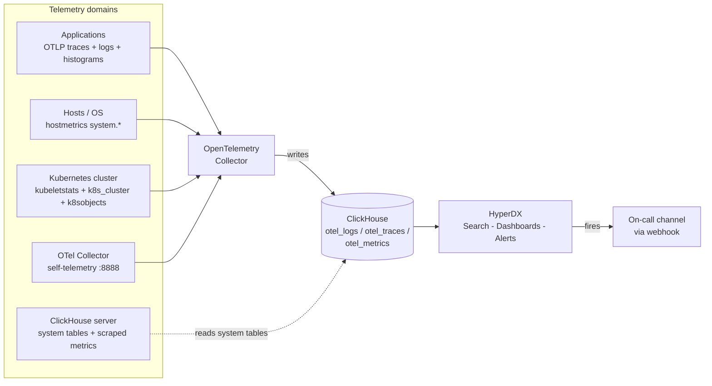

# ClickStack Dashboard Templates (Open Source / self-hosted HyperDX)

Download-and-go HyperDX dashboards for customers running **Open Source ClickStack**
(HyperDX + ClickHouse + OpenTelemetry). Each domain is a separate dashboard so customers
enable only what they run.

## Import in ~5 minutes

**PowerShell (Windows):**

```powershell
# 1. Get the templates
git clone https://github.com/Cameron-Bayer/AldoTel-Templates.git
cd AldoTel-Templates/hyperdx

# 2. Point at your HyperDX API (Team Settings → API Keys → Personal API Access Key)
$env:HDX_API_URL = "http://localhost:8000"
$env:HDX_API_KEY = "<your Personal API Access Key>"

# 3. Check what has data, then import
./preflight.ps1       # rates each dashboard OK/DEGRADED/FAIL
./import.ps1          # upserts the default dashboards (idempotent)
./import.ps1 -Advanced   # also import the advanced/ deep dives (optional data sources)
```

**bash (macOS / Linux):**

```bash
# 1. Get the templates
git clone https://github.com/Cameron-Bayer/AldoTel-Templates.git
cd AldoTel-Templates/hyperdx

# 2. Point at your HyperDX API (Team Settings → API Keys → Personal API Access Key)
export HDX_API_URL="http://localhost:8000"
export HDX_API_KEY="<your Personal API Access Key>"

# 3. Check what has data, then import
./preflight.sh        # rates each dashboard OK/DEGRADED/FAIL
./import.sh           # upserts the default dashboards (idempotent)
./import.sh --advanced   # also import the advanced/ deep dives (optional data sources)
```

Prefer a subset? `./import.sh --only traces.json,logs.json`. The **default**
import covers the six dashboards that populate on a standard appliance deploy; the **advanced/**
tier (`--advanced`) adds the `observability-platform-health` deep dive, which needs optional data
sources (collector self-telemetry, ClickHouse metrics, and `system.*` SQL access). Full details,
flags, and prerequisites are in [Install](#install) below.

> 📖 **New here? Start with the [Dashboard Catalog & Field Guide](DASHBOARD-CATALOG.md)** — a
> plain-language, per-dashboard breakdown of what each one is for, why you'd use it, exactly what
> telemetry it needs, and how to read it. It also groups the dashboards into **setup tiers** so you
> know which work with zero setup vs. which need a collector receiver or app instrumentation.
>
> 🔍 **Want to go deeper?** The [Dashboard Deep-Dive](DASHBOARD-DEEP-DIVE.md) walks through every
> dashboard tile-by-tile in a Q&A format — what each visual shows, how to read it, and what to do
> when it lights up.
>
> 📄 **Per-dashboard reference pages** (auto-generated, optional) live in [`docs/`](docs/) — one page
> per dashboard with a screenshot and every tile's query. Handy for lookups; not needed to install.

**Default dashboards** (`dashboards/` — import these first; populated on a standard appliance deploy):

| File | What it shows | Source kind |
|------|---------------|-------------|
| `dashboards/overview.json` | Unified landing page: environment/platform health, resource and service health, ClickHouse queries/storage/merges/cache/inserts, impacted clusters/nodes, and recent events | metric + trace + log + ClickHouse SQL |
| `dashboards/infrastructure.json` | Infrastructure overview: hosts & nodes, compute/memory, per-volume storage, network reliability, utilization hotspots, capacity risks, growth forecasting, and scale recommendations | metric |
| `dashboards/kubernetes.json` | Kubernetes overview: cluster and node health, inventory, namespaces, deployments, pods, containers, limit utilization, warning events, and impacted resources | metric + log |
| `dashboards/metrics.json` | Unified Metrics experience: infrastructure health, compute/processes, storage, networking, Kubernetes nodes/namespaces/workloads/containers/events, utilization analysis, and capacity planning | metric + log |
| `dashboards/traces.json` | Full traces experience: service overview, RED request health, latency analysis, trace search/waterfalls, dependency analysis, error correlation, and SLO compliance | trace |
| `dashboards/logs.json` | Log overview, full search workspace, service/resource/cluster/host/namespace/pod filters, severity trends, normalized/new patterns, and live streams | log |
| `dashboards/supportability.json` | Active alert-condition summary and guided ALM/ALRS/resource-provider/Kubernetes/network/storage troubleshooting, plus a recurring-signature known-issues view | log + trace + metric |

**Advanced dashboards** (`dashboards/advanced/` — opt-in with `--advanced`; each needs an
**optional data source** that a standard appliance deploy does not ingest by default):

| File | What it shows | Needs |
|------|---------------|-------|
| `dashboards/advanced/observability-platform-health.json` | The observability stack itself: ingestion and pipeline health, ClickHouse storage/availability, query mix and inserts, merges/mutations, cache reads, async inserts, retention, and dashboard-query performance | collector `:8888` self-telemetry scraped into OTel; ClickHouse metrics scraped into OTel; Raw SQL on `system.query_log`, `system.parts`, `system.merges`, and `system.mutations` |

## Per-dashboard reference

Every dashboard has a per-tile reference page in [`docs/`](docs/) — one page per dashboard listing
the ClickHouse tables, columns, and queries behind every visual. See the
[reference index](docs/README.md) for `overview`, `infrastructure`, `kubernetes`, `metrics`,
`traces`, `logs`, `supportability`, and the advanced `observability-platform-health` board. For
the "which and why" and the tile-by-tile Q&A, see [`DASHBOARD-CATALOG.md`](DASHBOARD-CATALOG.md)
and [`DASHBOARD-DEEP-DIVE.md`](DASHBOARD-DEEP-DIVE.md).

## Architecture — how it fits together

**Collect once, use everywhere.** Your applications, Kubernetes cluster, the OpenTelemetry
Collector, and ClickHouse all emit telemetry that lands in ClickHouse. HyperDX reads it back
for search, dashboards, and alerting — a **read-only consumer** of data ClickStack already
stores, so there's no extra collection cost or risk.


```mermaid
flowchart LR
    subgraph Domains["Telemetry domains"]
        A["Applications<br/>OTLP traces + logs + histograms"]
        H["Hosts / OS<br/>hostmetrics system.*"]
        K["Kubernetes cluster<br/>kubeletstats + k8s_cluster + k8sobjects"]
        COL["OTel Collector<br/>self-telemetry :8888"]
        CHm["ClickHouse server<br/>system tables + scraped metrics"]
    end
    A --> C["OpenTelemetry<br/>Collector"]
    H --> C
    K --> C
    COL --> C
    C -->|writes| CH[("ClickHouse<br/>otel_logs / otel_traces /<br/>otel_metrics")]
    CHm -.->|reads system tables| CH
    CH --> HDX["HyperDX<br/>Search - Dashboards - Alerts"]
    HDX -->|fires| NOTIFY["On-call channel<br/>via webhook"]
```

HyperDX and Grafana are two lenses on that one data set:

| Layer | Tool | What it answers |
|-------|------|-----------------|
| **Investigation** | **HyperDX** *(this folder)* | "Something is wrong — show me the traces, logs, and spans so I can find the root cause." |
| **At-a-glance health + paging** | **Grafana** ([`../grafana/`](../grafana/README.md)) | "Is everything healthy right now?" and "Tell me the moment it isn't." |

Because every tile relies only on ClickStack's **standard OpenTelemetry schema**, the same
dashboards work on any customer's cluster unchanged — symptom-to-root-cause in one click, with
no vendor lock-in.

## Why these "just work": the schema contract

A HyperDX dashboard does not contain data — every tile points at a **Source** (Logs / Traces /
Metrics) which maps to **ClickHouse tables and column names**. Templates are portable only when
everyone lands data in the **standard ClickStack OTel schema** (`otel_logs`, `otel_traces`,
`otel_metrics_gauge/sum/histogram`). That is exactly what the default ClickStack OTel collector
produces, so ship the collector config alongside these dashboards as the contract.

The one thing that differs per install is the **Source IDs / connection ID / database name**.
The importer resolves those at install time, so the JSON stays portable.

## Prerequisites

1. A running OSS ClickStack with the three default sources created in HyperDX:
   a **Logs** (kind `log`), **Traces** (kind `trace`), and **Metrics** (kind `metric`) source.
2. Telemetry flowing in via the standard OTel collector:
   - `hostmetrics` receiver (`system.*`) + `kubeletstats` + `k8s_cluster` receivers for `infrastructure`, `kubernetes`, and the unified `metrics` dashboard (add `k8sobjects` for the cluster-events tiles)
   - app traces for `traces`; app/container logs for `logs`
   - collector `:8888` self-telemetry + ClickHouse metrics + `SELECT` on `system.*` for the advanced `observability-platform-health`
   - `overview` and `supportability` roll up whatever is flowing (they degrade gracefully)
3. A **Personal API Access Key**: HyperDX → **Team Settings → API Keys**.

## Install

> **Run the pre-flight check first.** It queries your live install and tells you which dashboards
> have data flowing (so you don't import a dashboard that renders empty). See
> [Pre-flight](#pre-flight-will-it-work-here) below.

### 0. Get the templates

```bash
git clone https://github.com/Cameron-Bayer/AldoTel-Templates.git
cd AldoTel-Templates/hyperdx
```

> Or grab a pinned release from the [Releases](https://github.com/Cameron-Bayer/AldoTel-Templates/releases)
> page / **Code → Download ZIP**. If your HyperDX API isn't already reachable, port-forward it first:
> `kubectl port-forward -n clickstack svc/clickstack-app 8000:8000`.

### Windows (PowerShell)
```powershell
$env:HDX_API_URL = "http://localhost:8000"
$env:HDX_API_KEY = "<your Personal API Access Key>"
./preflight.ps1            # check compatibility (recommended)
./import.ps1               # upsert all dashboards
```

### macOS / Linux (bash, needs `curl` + `jq`)
```bash
export HDX_API_URL="http://localhost:8000"
export HDX_API_KEY="<your Personal API Access Key>"
./preflight.sh            # check compatibility (recommended)
./import.sh              # upsert all dashboards
```

The importer:
1. `GET /api/v2/sources` → picks source IDs by `kind`, plus the ClickHouse `connection` id and
   database/table names.
2. Substitutes the `{{TOKENS}}` in each template.
3. **Upserts** each dashboard: it matches an existing copy by the stable `tmpl:<slug>` tag and
   updates it in place (`PUT`); otherwise it creates a new one (`POST`). Re-running is therefore
   idempotent — no duplicates.

### Importer flags (same on PowerShell `-Flag` and bash `--flag`)

| Flag | Effect |
|------|--------|
| `-DryRun` / `--dry-run` | Print what would be created/updated/deleted; write nothing. |
| `-Only <files>` / `--only <files>` | Comma-separated file names to act on (e.g. `traces.json,logs.json`). |
| `-Delete` / `--delete` | Remove the template-managed dashboards (matched by `tmpl:` tag). |
| `-Duplicate` / `--duplicate` | Force-create new copies even if a matching dashboard exists. |

```powershell
./import.ps1 -DryRun
./import.ps1 -Only traces.json,logs.json
./import.ps1 -Delete
```

## Pre-flight: will it work here?

`preflight.ps1` / `preflight.sh` reads `requirements.json` and, for every metric/field a dashboard
needs, runs a lightweight `POST /api/v2/charts/series` query against your install to see whether
data is actually flowing. Each dashboard is rated:

- **OK** — all required *and* optional checks have data.
- **DEGRADED** — all required checks pass; some optional tiles will be empty.
- **FAIL** — a required check has no data; don't import as-is (your collector isn't sending it).
- **UNKNOWN** — a probe still failed after retries; rerun preflight rather than treating it as
  missing telemetry.

It then prints a `--only` command listing the dashboards whose **OTel source data** is present.

Preflight keeps probes lightweight: high-frequency metrics use only the latest **60 minutes**,
identical checks shared by multiple dashboards are queried once and cached, and transient query
failures are retried twice. Logs and traces retain the default 24-hour lookback because they may be
sparse. Tune the bounds when needed:

```powershell
./preflight.ps1 -MetricProbeMinutes 15 -LookbackHours 6 -QueryRetries 3
```

```bash
./preflight.sh --metric-minutes 15 --hours 6 --retries 3
```

> **Scope — what preflight does and does not check.** Preflight verifies only that the
> **OTel telemetry** each dashboard reads (metrics / traces / logs) is flowing. It does **not**
> validate ClickHouse **Raw SQL** access. The advanced `observability-platform-health` board's
> Raw-SQL tiles — data retention (`system.parts`) and the query-performance tiles
> (`system.query_log`) — additionally need the HyperDX ClickHouse connection user to be able to
> `SELECT` from those `system.*` tables (with `query_log` enabled). Preflight can't see those
> permissions, so a Raw-SQL tile it lists may still render empty if the connection user lacks
> `SELECT`. See the per-dashboard `receivers` notes in
> [`requirements.json`](./requirements.json) / the [Support matrix](#support-matrix) below.

## Alerts pack

Optional bundle of importable **alert** definitions in [`alerts/`](alerts/README.md) — one per
high-level signal (services error rate, SLO fast burn, collector drops, ClickHouse disk low).
Each binds to a dashboard tile and notifies a channel (a generic webhook you point
at your on-call system) when a threshold is breached. Portable and idempotent like the dashboards.

```powershell
# import dashboards first, then:
./import-alerts.ps1 -DryRun                     # preview
./import-alerts.ps1                             # upsert (reuses a webhook named "ClickStack Alerts")
# first-time channel setup (creates the webhook):
$env:HDX_EMAIL="you@corp.com"; $env:HDX_PASS="***"; $env:HDX_APP_URL="http://localhost:3000"
./import-alerts.ps1 -WebhookUrl "https://your-webhook-endpoint.example/hooks/xxxx"
```

Thresholds are opinionated defaults, tunable per install. See [`alerts/README.md`](alerts/README.md)
for the full signal table, channel setup, and tuning notes.

## Grafana dashboards

Prefer Grafana, or want a high-level/executive view? [`../grafana/`](../grafana/README.md) contains six
importable Grafana dashboards that read the **same ClickHouse data** — no extra collectors or schema
changes. They use the [ClickHouse data source](https://grafana.com/grafana/plugins/grafana-clickhouse-datasource/)
and a portable **datasource variable**, so on import you just pick your ClickHouse connection:

- **Overview** — one pane combining top signals across services, Kubernetes, resource utilization, logs, and recent cluster events.
- **Service Health** — RED metrics per service from `otel_traces`.
- **Kubernetes Cluster Overview** — nodes, pods, CPU/memory, restarts, container-vs-limit utilization, and cluster events.
- **Logs & Errors Overview** — volume by severity, error rate, and recent errors from `otel_logs`.
- **Infrastructure** — cluster/node health, host CPU/load/memory, per-volume storage capacity and latency, network throughput and errors, and capacity headroom.
- **Services (Latency Histograms)** *(advanced, opt-in)* — average latency and request rate from `otel_metrics_histogram`.

The service/Kubernetes/logs/infrastructure/latency boards include **Service / Namespace / Host filter dropdowns**. See
[`../grafana/README.md`](../grafana/README.md) for customer quick-start and import steps.

**Grafana alerts:** the [`../grafana/alerting/`](../grafana/alerting/README.md) folder adds six
provisioned Grafana unified-alerting rules over the same ClickHouse data (service error
rate, p95 latency, trace ingestion stalled, pods not Running, error-log rate, fatal logs) —
a generic webhook by default, tunable thresholds. This is the Grafana-native counterpart to
the HyperDX [Alerts pack](#alerts-pack) above: use HyperDX to investigate, Grafana to page.

## Support matrix

What each dashboard needs from your OpenTelemetry collector. **Required** checks must have data or
the dashboard is rated FAIL; **optional** tiles degrade gracefully (render empty) when absent.
Authoritative, machine-readable version: [`requirements.json`](./requirements.json).

| Dashboard | Source kind | Required receivers / signals | Optional (degrades) |
|-----------|-------------|------------------------------|---------------------|
| `overview` | metric + trace + log + ClickHouse SQL | None hard-required for the cross-signal sections; ClickHouse workload panels require read access to `system.*` tables | environment/platform health, CPU/memory/storage/network, request/log health, ClickHouse queries/inserts/merges/cache, impacted clusters, and events |
| `infrastructure` | metric | `hostmetrics` receiver — `system.cpu.utilization`, `system.memory.utilization`; `kubeletstats` + `k8s_cluster` — `k8s.node.condition_ready` | `system.cpu.load_average.1m`, `system.filesystem.{usage,inodes.usage}`, `system.memory.usage`, `system.disk.{operations,operation_time,io}`, `system.network.{io,dropped,errors}`, `k8s.node.uptime` |
| `kubernetes` | metric + log | `kubeletstats` + `k8s_cluster` receivers — `k8s.node.condition_ready`, `k8s.deployment.{available,desired}`, `k8s.pod.{phase,cpu,memory}`, `k8s.container.restarts`; `hostmetrics` — `system.{cpu,memory}.utilization` | `system.filesystem.usage`; container-vs-limit tiles use `k8s.container.{cpu,memory}_limit_utilization` / request utilization + `container.uptime`; cluster tables need the `k8sobjects` receiver |
| `metrics` | metric + log | Unified hostmetrics + Kubernetes view: `system.{cpu,memory}.utilization`, `k8s.node.condition_ready`, deployment/pod/container metrics | swap/process metrics, direct `k8s.node.{cpu,memory,filesystem}.*`, disk/network performance, capacity forecasts, and `k8sobjects` events |
| `traces` | trace + optional metric/SQL | Application traces (OTLP) — server spans (`SpanKind:Server`) | error/client spans; HTTP/RPC/peer attributes; route tiles use `http.route`; platform panels use collector self-telemetry and ClickHouse `system.*`; Keeper latency needs separate Keeper scraping |
| `logs` | log | Application/container logs (filelog or OTLP) — any log volume | error logs (`SeverityNumber>=17` or `SeverityText:error/fatal`) |
| `supportability` | log + trace + metric | None hard-required — incident-triage roll-up; each section degrades to whatever signal is present | traces (error %), logs (error %, signatures, sources), k8s metrics (pods not Running, restarts), `k8sobjects` events |
| `observability-platform-health` _(advanced)_ | metric + SQL | None hard-required (degrades). Ingestion/pipeline tiles use collector `:8888` self-telemetry (`otelcol_receiver_accepted_*`, `otelcol_exporter_{sent_spans,queue_size,queue_capacity}`); availability tiles use `ClickHouseMetrics_{Query,MemoryTracking}` | ClickHouse metrics scraped into OTel; Raw SQL on `system.query_log` (query performance, top errors) and `system.parts` (data retention) — HyperDX ClickHouse user must `SELECT` from them, `query_log` enabled |

**Baseline requirements (all dashboards):** HyperDX **≥ 2.27** (v2 dashboard API), the three
default sources created in HyperDX (`log` / `trace` / `metric`), and data landed in the standard
ClickStack OTel schema (`otel_logs`, `otel_traces`, `otel_metrics_{gauge,sum,histogram}`).

> Metric names vary by collector config. The names above are the defaults verified against a live
> OSS ClickStack; if `preflight` reports a required metric missing, your exporter likely emits it
> under a different name — check the metric names your collector actually produces (in ClickHouse:
> `SELECT DISTINCT MetricName FROM otel_metrics_gauge`), then adjust `metricName` in the tile (and
> `requirements.json`).

## Dashboard filters (variables)

Every dashboard ships a top-of-page **filter bar** (`filters[]`) so one template serves a busy
multi-tenant cluster without editing tiles. Pick a value and all tiles bound to that source
re-scope. What each exposes:

- **Service** — `traces`, `logs`, `supportability`; on `overview`, **Service** scopes traces and
  **Log Service** scopes logs.
- **Namespace** — `kubernetes`, `overview`, `supportability`.
- **Host** — `infrastructure`.
- **Event Namespace** — `metrics` (event/log panels only).
- **Severity** — `logs`, `supportability`.
- **Collector** — `observability-platform-health` (`service.instance.id`).

> Filters bind to one source. On `overview`, **Service** scopes trace tiles, **Log Service** scopes
> log tiles, and **Namespace** scopes metric tiles. On `supportability`, Service and Namespace remain
> source-specific; tiles from other sources are unaffected. Metrics intentionally avoids global
> Host/Namespace metric filters because one would hide the other telemetry domain; its Event
> Namespace filter applies only to Kubernetes event logs.

## Customizing

- **Metric names depend on how ClickHouse exposes metrics.** The advanced
  `observability-platform-health` tiles use the common `ClickHouseProfileEvents_*` /
  `ClickHouseMetrics_*` and `otelcol_*` collector-self-telemetry names. If you scrape via a
  different exporter, adjust `metricName` in the tiles.
- Grid is **24 columns wide**; tiles use `x,y,w,h`.
- `aggFn` options: `count`, `sum`, `avg`, `min`, `max`, `quantile` (needs `level`),
  `count_distinct`, `last_value`.
- Number tiles support conditional coloring via `colorRules`
  (operators `gt/gte/lt/lte`, palette tokens like `chart-error`, `chart-warning`).

## Advanced SQL / anomaly-detection tiles (Raw SQL)

Several tiles use the **Raw SQL** variant (`configType: "sql"`) to go beyond static charts:

- **Range-aware SQL buckets:** time-series SQL derives its interval from the selected start/end
  timestamps (approximately 120 buckets) instead of relying on HyperDX's optional
  `intervalSeconds` substitution. Continuous numeric values display two decimal places, while
  inherently discrete counts display as whole numbers.
- **`traces` → latency anomaly:** plots p95 latency against a **causal rolling baseline
  with ±3σ control bands** (trailing ~8-day window that ends before each point), so a spike is
  flagged relative to its own recent baseline rather than a static threshold — and an in-progress
  incident can't poison the baseline it's measured against.
- **`logs` / `supportability` → errors & fatals by service:** a 24h no-regex per-service aggregate
  (error + fatal counts, last-seen) that replaced the older heavy "new log patterns" regex scan,
  which was repeatedly killed by ClickHouse's server-wide `OvercommitTracker` on memory-constrained
  instances. Click a row to drill into the matching **Logs**.
- **`traces` → SLO strip:** a folded-in Availability (SLI) number, Error-budget-remaining
  number, and a **multi-window burn-rate** table against a 99.9% SLO
  (`>1` = burning budget too fast) — the reliability view that used to be a separate dashboard.
- **`observability-platform-health` _(advanced)_ → `system.query_log`:** query duration p95/p99,
  failed queries, and a top-errors table — read directly from ClickHouse's own `system.query_log`
  (requires the HyperDX ClickHouse user to have `SELECT` on it).
- **`observability-platform-health` _(advanced)_ → `system.parts`:** data retention & size by table —
  read straight from ClickHouse's own storage system tables (no metrics pipeline needed).
- **All builder tables over Logs/Traces → click-through drill-downs:** table tiles use tile
  `onClick` (table-only) to link a clicked row straight into the **Traces** or **Logs** search,
  pre-filtered from the row — turning every table into a triage launcher:
  - `traces`: slowest routes → Traces (`SpanAttributes['http.route'] = '{{...}}'`).
  - `logs` / `supportability`: error signatures, errors-by-service, and k8s error sources → Logs.

Both run entirely as ClickHouse SQL — no extra service. Other easy extensions:
disk-fill forecasting (linear fit on disk growth), `compareToPreviousPeriod: true` for instant
week-over-week baselining (already enabled on the ClickHouse query-rate tile), and SLO
error-budget burn-rate tiles.

## Glossary

| Term | Meaning |
|------|---------|
| **ClickStack** | The telemetry stack (HyperDX + OpenTelemetry + ClickHouse) that collects and stores your observability data. |
| **HyperDX** | The observability UI for searching telemetry and building dashboards/alerts on ClickHouse. |
| **ClickHouse** | The high-performance database where all telemetry is stored. |
| **OpenTelemetry (OTel)** | The vendor-neutral standard for collecting traces, logs, and metrics. |
| **OTel Collector** | The agent that receives telemetry and writes it to ClickHouse; also emits its own health metrics. |
| **RED method** | Rate, Errors, Duration — the standard way to measure service health. |
| **SLO / error budget / burn rate** | A reliability target, how much failure you can still absorb, and how fast you're consuming it. |
| **p95 / p99** | The value under which 95% / 99% of measurements fall — better than an average for spotting outliers. |
| **Span / trace** | A single unit of work (span) and the end-to-end path of a request (trace). |
| **MergeTree / parts** | ClickHouse's storage engine and its on-disk data fragments; too many parts is a common failure mode. |
| **Keeper** | ClickHouse's consensus/coordination service that keeps replicas in sync. |
| **Webhook** | A URL HyperDX posts to when an alert fires (your on-call channel's endpoint). |

## Notes

- **Credentials** — the API key and any webhook URL are environment secrets; keep them out of
  version control.
- **HTTP-oriented tiles degrade on non-HTTP services.** `traces`'s route tiles read
  `SpanAttributes['http.route']` and `StatusMessage`; pure gRPC/messaging services that don't set
  those will show empty/`(none)` rows there while the rate/error/latency tiles still work.
- The importer **upserts** (matches by the `tmpl:<slug>` tag), so re-running updates dashboards in
  place instead of duplicating them. Use `-Delete` / `--delete` to remove them, or
  `-Duplicate` / `--duplicate` to force new copies.

## Maintainers

Regenerating the reference docs, the HyperDX v2 API details, and other maintainer
workflows are documented in [`../CONTRIBUTING.md`](../CONTRIBUTING.md).
