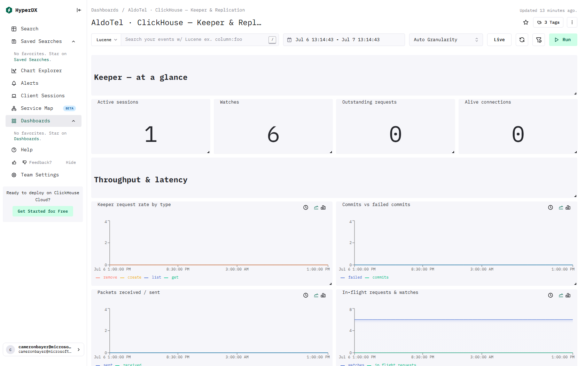

# ClickStack - ClickHouse - Keeper & Replication

> This page lists the ClickHouse tables and columns behind every visual on the dashboard.

[← Reference index](README.md) · [Dashboard catalog](../DASHBOARD-CATALOG.md) · [Deep dive](../DASHBOARD-DEEP-DIVE.md) · [HyperDX install guide](../README.md)

- **Template:** `dashboards/advanced/clickhouse-keeper-replication.json` · tag `tmpl:ch-keeper`
- **Data required:** ClickHouse metrics scraped into OTel (Keeper gauges/ProfileEvents); Replication tables read system.replicas / system.replication_queue via Raw SQL — these are empty on single-node installs and populate only on replicated/clustered ClickHouse

## Preview



_Live capture from a ClickStack install with the OpenTelemetry demo flowing._

## Keeper — coordination health
ClickHouse **Keeper** (a ZooKeeper-compatible service) manages replicated-table metadata and cluster consensus. These panels use Keeper gauges and cumulative ProfileEvent counters exported via OTel, and are empty when Keeper/ZooKeeper isn't configured. **Sessions** = connected clients; **Watches** = change subscriptions (unexpected sustained growth can indicate leaked clients); **Outstanding requests** = requests queued awaiting processing. Session and connection counts are workload-dependent.

### Active sessions — number

- **Source / table:** Metrics → `default.otel_metrics_gauge`
- **Metric(s):** `ClickHouseMetrics_ZooKeeperSession`  (column `MetricName`)
- **Measure(s):** last_value(`Value`)
- **Columns used:** `Value`, `MetricName`, `TimeUnix`

### Watches — number

- **Source / table:** Metrics → `default.otel_metrics_gauge`
- **Metric(s):** `ClickHouseMetrics_ZooKeeperWatch`  (column `MetricName`)
- **Measure(s):** last_value(`Value`)
- **Columns used:** `Value`, `MetricName`, `TimeUnix`

### Outstanding requests — number

- **Source / table:** Metrics → `default.otel_metrics_gauge`
- **Metric(s):** `ClickHouseMetrics_KeeperOutstandingRequests`  (column `MetricName`)
- **Measure(s):** last_value(`Value`)
- **Columns used:** `Value`, `MetricName`, `TimeUnix`

### Alive connections — number

- **Source / table:** Metrics → `default.otel_metrics_gauge`
- **Metric(s):** `ClickHouseMetrics_KeeperAliveConnections`  (column `MetricName`)
- **Measure(s):** last_value(`Value`)
- **Columns used:** `Value`, `MetricName`, `TimeUnix`

## Throughput & latency

### Keeper requests per interval, by type — line · Raw SQL

- **Tables:** `default.otel_metrics_sum`

<details><summary>SQL query</summary>

```sql
SELECT ts, kind, sum(greatest(cum - prev, 0)) AS value FROM (
  SELECT ts, inst, kind, cum, lagInFrame(cum, 1, cum) OVER (PARTITION BY kind, inst ORDER BY ts) AS prev
  FROM (
    SELECT toStartOfInterval(TimeUnix, INTERVAL {intervalSeconds:Int64} SECOND) AS ts,
           ResourceAttributes['service.instance.id'] AS inst,
           multiIf(MetricName = 'ClickHouseProfileEvents_KeeperGetRequest', 'get', MetricName = 'ClickHouseProfileEvents_KeeperListRequest', 'list', MetricName = 'ClickHouseProfileEvents_KeeperCreateRequest', 'create', MetricName = 'ClickHouseProfileEvents_KeeperRemoveRequest', 'remove', 'get') AS kind,
           max(Value) AS cum
    FROM default.otel_metrics_sum
    WHERE TimeUnix >= fromUnixTimestamp64Milli({startDateMilliseconds:Int64})
      AND TimeUnix <= fromUnixTimestamp64Milli({endDateMilliseconds:Int64})
      AND MetricName IN ('ClickHouseProfileEvents_KeeperGetRequest', 'ClickHouseProfileEvents_KeeperListRequest', 'ClickHouseProfileEvents_KeeperCreateRequest', 'ClickHouseProfileEvents_KeeperRemoveRequest')
    GROUP BY ts, inst, kind
  )
)
GROUP BY ts, kind
ORDER BY ts
```

</details>

### Commits vs failed commits (per interval) — line · Raw SQL

- **Tables:** `default.otel_metrics_sum`

<details><summary>SQL query</summary>

```sql
SELECT ts, kind, sum(greatest(cum - prev, 0)) AS value FROM (
  SELECT ts, inst, kind, cum, lagInFrame(cum, 1, cum) OVER (PARTITION BY kind, inst ORDER BY ts) AS prev
  FROM (
    SELECT toStartOfInterval(TimeUnix, INTERVAL {intervalSeconds:Int64} SECOND) AS ts,
           ResourceAttributes['service.instance.id'] AS inst,
           multiIf(MetricName = 'ClickHouseProfileEvents_KeeperCommits', 'commits', MetricName = 'ClickHouseProfileEvents_KeeperCommitsFailed', 'failed', 'commits') AS kind,
           max(Value) AS cum
    FROM default.otel_metrics_sum
    WHERE TimeUnix >= fromUnixTimestamp64Milli({startDateMilliseconds:Int64})
      AND TimeUnix <= fromUnixTimestamp64Milli({endDateMilliseconds:Int64})
      AND MetricName IN ('ClickHouseProfileEvents_KeeperCommits', 'ClickHouseProfileEvents_KeeperCommitsFailed')
    GROUP BY ts, inst, kind
  )
)
GROUP BY ts, kind
ORDER BY ts
```

</details>

### Packets received / sent (per interval) — line · Raw SQL

- **Tables:** `default.otel_metrics_sum`

<details><summary>SQL query</summary>

```sql
SELECT ts, kind, sum(greatest(cum - prev, 0)) AS value FROM (
  SELECT ts, inst, kind, cum, lagInFrame(cum, 1, cum) OVER (PARTITION BY kind, inst ORDER BY ts) AS prev
  FROM (
    SELECT toStartOfInterval(TimeUnix, INTERVAL {intervalSeconds:Int64} SECOND) AS ts,
           ResourceAttributes['service.instance.id'] AS inst,
           multiIf(MetricName = 'ClickHouseProfileEvents_KeeperPacketsReceived', 'received', MetricName = 'ClickHouseProfileEvents_KeeperPacketsSent', 'sent', 'received') AS kind,
           max(Value) AS cum
    FROM default.otel_metrics_sum
    WHERE TimeUnix >= fromUnixTimestamp64Milli({startDateMilliseconds:Int64})
      AND TimeUnix <= fromUnixTimestamp64Milli({endDateMilliseconds:Int64})
      AND MetricName IN ('ClickHouseProfileEvents_KeeperPacketsReceived', 'ClickHouseProfileEvents_KeeperPacketsSent')
    GROUP BY ts, inst, kind
  )
)
GROUP BY ts, kind
ORDER BY ts
```

</details>

### In-flight requests — line

- **Source / table:** Metrics → `default.otel_metrics_gauge`
- **Metric(s):** `ClickHouseMetrics_ZooKeeperRequest`  (column `MetricName`)
- **Measure(s):** avg(`Value`) as `in_flight_requests`
- **Columns used:** `Value`, `MetricName`, `TimeUnix`

### Watches — line

- **Source / table:** Metrics → `default.otel_metrics_gauge`
- **Metric(s):** `ClickHouseMetrics_ZooKeeperWatch`  (column `MetricName`)
- **Measure(s):** avg(`Value`) as `watches`
- **Columns used:** `Value`, `MetricName`, `TimeUnix`

### Keeper commit-wait & process latency (µs avg) — line · Raw SQL

- **Tables:** `default.otel_metrics_sum`

<details><summary>SQL query</summary>

```sql
SELECT ts, kind, sumIf(d, component = 'elapsed') / nullIf(sumIf(d, component = 'count'), 0) AS value FROM (
  SELECT ts, inst, kind, component, greatest(cum - lagInFrame(cum, 1, cum) OVER (PARTITION BY inst, kind, component ORDER BY ts), 0) AS d
  FROM (
    SELECT toStartOfInterval(TimeUnix, INTERVAL {intervalSeconds:Int64} SECOND) AS ts,
           ResourceAttributes['service.instance.id'] AS inst,
           multiIf(MetricName IN ('ClickHouseProfileEvents_KeeperCommitWaitElapsedMicroseconds', 'ClickHouseProfileEvents_KeeperCommits'), 'commit_wait_us', 'process_us') AS kind,
           if(MetricName IN ('ClickHouseProfileEvents_KeeperCommitWaitElapsedMicroseconds', 'ClickHouseProfileEvents_KeeperProcessElapsedMicroseconds'), 'elapsed', 'count') AS component,
           max(Value) AS cum
    FROM default.otel_metrics_sum
    WHERE TimeUnix >= fromUnixTimestamp64Milli({startDateMilliseconds:Int64})
      AND TimeUnix <= fromUnixTimestamp64Milli({endDateMilliseconds:Int64})
      AND MetricName IN ('ClickHouseProfileEvents_KeeperCommitWaitElapsedMicroseconds', 'ClickHouseProfileEvents_KeeperCommits', 'ClickHouseProfileEvents_KeeperProcessElapsedMicroseconds', 'ClickHouseProfileEvents_KeeperRequestTotal')
    GROUP BY ts, inst, kind, component
  )
)
GROUP BY ts, kind
ORDER BY ts
```

</details>

### Keeper / ZooKeeper errors — table · Raw SQL

- **Tables:** `default.otel_metrics_sum`

<details><summary>SQL query</summary>

```sql
SELECT error, sum(d) AS errors_in_window FROM (
  SELECT replaceOne(MetricName, 'ClickHouseErrorMetric_', '') AS error,
         ResourceAttributes['service.instance.id'] AS inst,
         greatest(max(Value) - min(Value), 0) AS d
  FROM default.otel_metrics_sum
  WHERE TimeUnix >= fromUnixTimestamp64Milli({startDateMilliseconds:Int64})
    AND TimeUnix <= fromUnixTimestamp64Milli({endDateMilliseconds:Int64})
    AND (MetricName LIKE '%ZOOKEEPER%' OR MetricName LIKE '%KEEPER%')
    AND MetricName LIKE 'ClickHouseErrorMetric_%'
  GROUP BY error, inst
)
GROUP BY error
HAVING errors_in_window > 0
ORDER BY errors_in_window DESC
LIMIT 20
```

</details>

## Replication
The tables below populate only on **replicated / clustered** ClickHouse installs (`ReplicatedMergeTree`). On a single-node ClickStack they are expected to be empty — that is healthy, not an error. Non-empty `replication_queue` rows or a growing `absolute_delay` indicate a replica falling behind.

### Max replication lag (s) — number · Raw SQL

- **Tables:** `system.replicas`

<details><summary>SQL query</summary>

```sql
SELECT max(absolute_delay) AS "Max replication lag (s)" FROM system.replicas
```

</details>

### Replica status — table · Raw SQL

- **Tables:** `system.replicas`

<details><summary>SQL query</summary>

```sql
SELECT database,
       table,
       is_leader,
       is_readonly,
       absolute_delay,
       queue_size,
       inserts_in_queue,
       merges_in_queue,
       total_replicas,
       active_replicas
FROM system.replicas
ORDER BY absolute_delay DESC, queue_size DESC
LIMIT 30
```

</details>

### Replication queue (highest retry counts) — table · Raw SQL

- **Tables:** `system.replication_queue`

<details><summary>SQL query</summary>

```sql
SELECT database,
       table,
       type,
       num_tries,
       num_postponed,
       last_exception,
       create_time
FROM system.replication_queue
ORDER BY num_tries DESC
LIMIT 30
```

</details>
