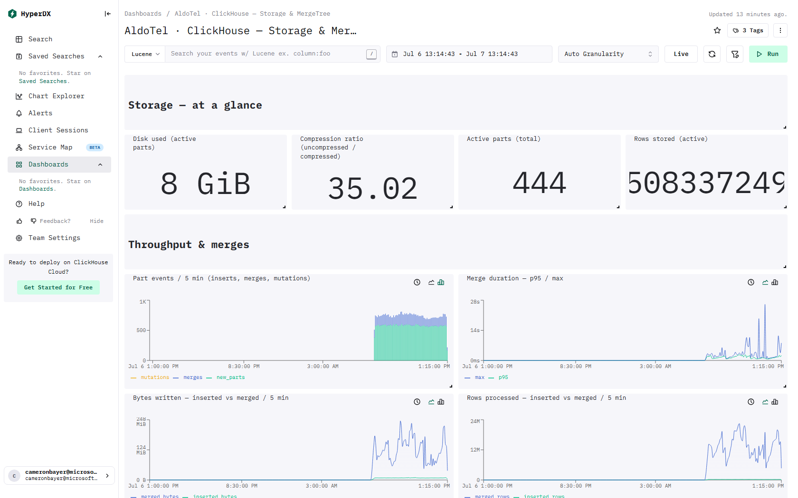

# ClickStack - ClickHouse - Storage & MergeTree

> This page lists the ClickHouse tables and columns behind every visual on the dashboard.

[← Reference index](README.md) · [Dashboard catalog](../DASHBOARD-CATALOG.md) · [Deep dive](../DASHBOARD-DEEP-DIVE.md) · [HyperDX install guide](../README.md)

- **Template:** `dashboards/advanced/clickhouse-storage-mergetree.json` · tag `tmpl:ch-storage`
- **Data required:** All tiles read system.parts / system.part_log via Raw SQL — the HyperDX ClickHouse connection user must be able to SELECT from system.parts and system.part_log (part_log must be enabled, which it is by default)

## Preview



_Live capture from a ClickStack install with the OpenTelemetry demo flowing._

## Storage & MergeTree health
Disk usage, data parts, merges, and mutations from ClickHouse system tables (`system.parts`, `system.disks`, `system.merges`, `system.mutations`, `system.part_log`) — the connected user must be able to read these, and the part-event charts need `part_log` collection enabled. **MergeTree basics:** data lives in immutable **parts**; background **merges** compact small parts into larger ones, and **mutations** rewrite parts to apply UPDATE/DELETE/TTL. A sustained rise in part counts or pending mutations means background work is falling behind.

## Storage — at a glance

### Disk used (active parts) — number · Raw SQL

- **Tables:** `system.parts`

<details><summary>SQL query</summary>

```sql
SELECT sum(bytes_on_disk) FROM system.parts WHERE active
```

</details>

### Compression ratio (higher = more space saved) — number · Raw SQL

- **Tables:** `system.parts`

<details><summary>SQL query</summary>

```sql
SELECT round(sum(data_uncompressed_bytes) / nullIf(sum(data_compressed_bytes), 0), 2) FROM system.parts WHERE active
```

</details>

### Active parts (total) — number · Raw SQL

- **Tables:** `system.parts`

<details><summary>SQL query</summary>

```sql
SELECT count() FROM system.parts WHERE active
```

</details>

### Rows stored (active) — number · Raw SQL

- **Tables:** `system.parts`

<details><summary>SQL query</summary>

```sql
SELECT sum(rows) FROM system.parts WHERE active
```

</details>

## Throughput & merges

### Part events / interval (inserts, merges, mutations) — stacked_bar · Raw SQL

- **Tables:** `system.part_log`

<details><summary>SQL query</summary>

```sql
SELECT toStartOfInterval(event_time, INTERVAL {intervalSeconds:Int64} SECOND) AS t,
       countIf(event_type = 'NewPart') AS new_parts,
       countIf(event_type = 'MergeParts') AS merges,
       countIf(event_type = 'MutatePart') AS mutations
FROM system.part_log
WHERE event_time >= fromUnixTimestamp64Milli({startDateMilliseconds:Int64})
  AND event_time <= fromUnixTimestamp64Milli({endDateMilliseconds:Int64})
GROUP BY t
ORDER BY t
```

</details>

### Merge duration - p95 / max — line · Raw SQL

- **Tables:** `system.part_log`

<details><summary>SQL query</summary>

```sql
SELECT toStartOfInterval(event_time, INTERVAL {intervalSeconds:Int64} SECOND) AS t,
       quantile(0.95)(duration_ms) / 1000 AS p95,
       max(duration_ms) / 1000 AS max
FROM system.part_log
WHERE event_type = 'MergeParts'
  AND event_time >= fromUnixTimestamp64Milli({startDateMilliseconds:Int64})
  AND event_time <= fromUnixTimestamp64Milli({endDateMilliseconds:Int64})
GROUP BY t
ORDER BY t
```

</details>

### Bytes written - inserted vs merged / interval — line · Raw SQL

- **Tables:** `system.part_log`

<details><summary>SQL query</summary>

```sql
SELECT toStartOfInterval(event_time, INTERVAL {intervalSeconds:Int64} SECOND) AS t,
       sumIf(size_in_bytes, event_type = 'NewPart') AS inserted_bytes,
       sumIf(size_in_bytes, event_type = 'MergeParts') AS merged_bytes
FROM system.part_log
WHERE event_time >= fromUnixTimestamp64Milli({startDateMilliseconds:Int64})
  AND event_time <= fromUnixTimestamp64Milli({endDateMilliseconds:Int64})
GROUP BY t
ORDER BY t
```

</details>

### Rows processed - inserted vs merged / interval — line · Raw SQL

- **Tables:** `system.part_log`

<details><summary>SQL query</summary>

```sql
SELECT toStartOfInterval(event_time, INTERVAL {intervalSeconds:Int64} SECOND) AS t,
       sumIf(rows, event_type = 'NewPart') AS inserted_rows,
       sumIf(rows, event_type = 'MergeParts') AS merged_rows
FROM system.part_log
WHERE event_time >= fromUnixTimestamp64Milli({startDateMilliseconds:Int64})
  AND event_time <= fromUnixTimestamp64Milli({endDateMilliseconds:Int64})
GROUP BY t
ORDER BY t
```

</details>

## Tables & parts
Per-table disk, rows, and part counts. **'Too many parts'**: rapidly growing part counts or many small parts mean merges can't keep up (ClickHouse throttles or rejects inserts once a table passes its `parts_to_throw_insert` limit) — evaluate against your configured limits.

### Largest tables by disk — table · Raw SQL

- **Tables:** `system.parts`

<details><summary>SQL query</summary>

```sql
SELECT database,
       table,
       formatReadableSize(sum(bytes_on_disk)) AS disk,
       sum(rows) AS rows,
       count() AS parts,
       round(sum(data_uncompressed_bytes) / nullIf(sum(data_compressed_bytes), 0), 2) AS compression
FROM system.parts
WHERE active
GROUP BY database, table
ORDER BY sum(bytes_on_disk) DESC
LIMIT 30
```

</details>

### Active parts per table (too-many-parts watch) — table · Raw SQL

- **Tables:** `system.parts`

<details><summary>SQL query</summary>

```sql
SELECT database,
       table,
       count() AS active_parts,
       sum(marks) AS marks,
       any(part_type) AS part_type,
       formatReadableSize(avg(bytes_on_disk)) AS avg_part_size
FROM system.parts
WHERE active
GROUP BY database, table
ORDER BY active_parts DESC
LIMIT 30
```

</details>

### Recent merges — table · Raw SQL

- **Tables:** `system.part_log`

<details><summary>SQL query</summary>

```sql
SELECT event_time,
       database || '.' || table AS tbl,
       duration_ms,
       rows,
       formatReadableSize(size_in_bytes) AS size,
       merge_reason,
       if(error = 0, 'ok', toString(error)) AS status
FROM system.part_log
WHERE event_type = 'MergeParts'
  AND event_time >= fromUnixTimestamp64Milli({startDateMilliseconds:Int64})
  AND event_time <= fromUnixTimestamp64Milli({endDateMilliseconds:Int64})
ORDER BY event_time DESC
LIMIT 30
```

</details>

### Disk free % — number · Raw SQL

- **Tables:** `system.disks`

<details><summary>SQL query</summary>

```sql
SELECT min(free_space / nullIf(total_space, 0)) AS "Disk free %"
FROM system.disks
```

</details>

### Active merges — number · Raw SQL

- **Tables:** `system.merges`

<details><summary>SQL query</summary>

```sql
SELECT count() AS "Active merges" FROM system.merges
```

</details>

### Pending mutations — number · Raw SQL

- **Tables:** `system.mutations`

<details><summary>SQL query</summary>

```sql
SELECT count() AS "Pending mutations" FROM system.mutations WHERE is_done = 0
```

</details>

### Disk free vs used — table · Raw SQL

- **Tables:** `system.disks`

<details><summary>SQL query</summary>

```sql
SELECT name,
       formatReadableSize(free_space) AS free,
       formatReadableSize(total_space - free_space) AS used,
       formatReadableSize(total_space) AS total,
       round(100 * free_space / nullIf(total_space, 0), 1) AS free_pct
FROM system.disks
ORDER BY free_pct ASC
```

</details>

### Current merges — table · Raw SQL

- **Tables:** `system.merges`

<details><summary>SQL query</summary>

```sql
SELECT database,
       table,
       elapsed,
       progress,
       num_parts,
       formatReadableSize(total_size_bytes_compressed) AS total_size_compressed
FROM system.merges
ORDER BY elapsed DESC
```

</details>

### Active mutations — table · Raw SQL

- **Tables:** `system.mutations`

<details><summary>SQL query</summary>

```sql
SELECT database,
       table,
       mutation_id,
       command,
       parts_to_do,
       is_done
FROM system.mutations
WHERE is_done = 0
ORDER BY parts_to_do DESC
```

</details>

## Capacity & background work
Disk headroom and in-flight merges/mutations. Investigate disk free below 15% (critical below 5%). A few pending mutations is normal; a large or growing backlog is not.
