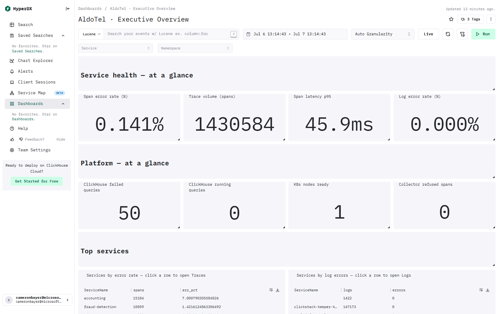

# ClickStack - Executive Overview

> This page lists the ClickHouse tables and columns behind every visual on the dashboard.

[← Reference index](README.md) · [Dashboard catalog](../DASHBOARD-CATALOG.md) · [Deep dive](../DASHBOARD-DEEP-DIVE.md) · [HyperDX install guide](../README.md)

- **Template:** `dashboards/executive-overview.json` · tag `tmpl:exec-overview`
- **Data required:** Application traces (OTLP), application/container logs, ClickHouse metrics and K8s metrics — this is a cross-cutting roll-up; tiles degrade gracefully when a given signal is absent

## Preview



_Live capture from a ClickStack install with the OpenTelemetry demo flowing._

## Dashboard filters

These apply to every compatible tile on the dashboard.

| Filter | Column / expression | Source |
|---|---|---|
| Service | `ServiceName` | Traces (`default.otel_traces`) |
| Namespace | `ResourceAttributes['k8s.namespace.name']` | Metrics (`default.otel_metrics_{gauge|sum|histogram}`) |

## Operational health overview
A single-pane summary of service and platform health from OpenTelemetry traces, logs, and Kubernetes metrics. Use the **Service** and **Namespace** filters and the time range. Amber/red stats mean elevated errors or latency; click a service row below to drill into its Logs or Traces.

## Service health — at a glance
Request volume, error rate, and latency from OpenTelemetry **server spans**, alongside the application-log error rate. p95 latency means 95% of requests completed within that time.

### Server error rate (%) — number

- **Source / table:** Traces → `default.otel_traces`
- **Measure(s):** avg(`if(StatusCode = 'Error', 1, 0)`)  — where `SpanKind = 'Server'` (sql)
- **Columns used:** `StatusCode`, `SpanKind`

### Server requests (selected range) — number

- **Source / table:** Traces → `default.otel_traces`
- **Measure(s):** count(*)  — where `SpanKind = 'Server'` (sql)
- **Columns used:** `SpanKind`

### 95th-percentile server latency (p95) — number

- **Source / table:** Traces → `default.otel_traces`
- **Measure(s):** quantile(`Duration / 1000000000`)  — where `SpanKind = 'Server'` (sql)
- **Columns used:** `Duration`, `SpanKind`

### Log error rate (%) — number

- **Source / table:** Logs → `default.otel_logs`
- **Measure(s):** avg(`if(SeverityNumber >= 17 OR lower(SeverityText) IN ('error','fatal'), 1, 0)`)
- **Columns used:** `SeverityText`

## Platform — at a glance

### Kubernetes nodes ready % — number · Raw SQL

- **Tables:** `default.otel_metrics_gauge`

<details><summary>SQL query</summary>

```sql
SELECT if(total = 0, 0, ready / total) AS "Nodes ready" FROM (
  SELECT countIf(ready = 1) AS ready, count() AS total FROM (
    SELECT ResourceAttributes['k8s.node.name'] AS node, argMax(Value, TimeUnix) AS ready
    FROM default.otel_metrics_gauge
    WHERE TimeUnix >= fromUnixTimestamp64Milli({startDateMilliseconds:Int64})
      AND TimeUnix <= fromUnixTimestamp64Milli({endDateMilliseconds:Int64})
      AND MetricName = 'k8s.node.condition_ready'
    GROUP BY node
  )
)
```

</details>

## Top services

### Services by error rate - click a row to open Traces — table

- **Source / table:** Traces → `default.otel_traces`
- **Measure(s):** count(*) as `Requests`  — where `SpanKind = 'Server'` (sql); avg(`if(StatusCode = 'Error', 100, 0)`) as `Error rate %`  — where `SpanKind = 'Server'` (sql)
- **Group by:** `ServiceName`
- **Order by:** `"Error rate %" DESC`
- **Drill-down:** click a row → opens search
- **Columns used:** `ServiceName`, `StatusCode`, `SpanKind`

### Services by log errors - click a row to open Logs — table

- **Source / table:** Logs → `default.otel_logs`
- **Measure(s):** count(*) as `logs`; sum(`if(SeverityNumber >= 17 OR lower(SeverityText) IN ('error','fatal'), 1, 0)`) as `errors`
- **Group by:** `ServiceName`
- **Order by:** `errors DESC`
- **Drill-down:** click a row → opens search
- **Columns used:** `ServiceName`, `SeverityText`

## Request traffic

### Request & error counts over time (traces) — line

- **Source / table:** Traces → `default.otel_traces`
- **Measure(s):** count(*) as `requests`  — where `SpanKind = 'Server'` (sql); sum(`if(StatusCode = 'Error', 1, 0)`) as `errors`  — where `SpanKind = 'Server'` (sql)
- **Columns used:** `StatusCode`, `SpanKind`
