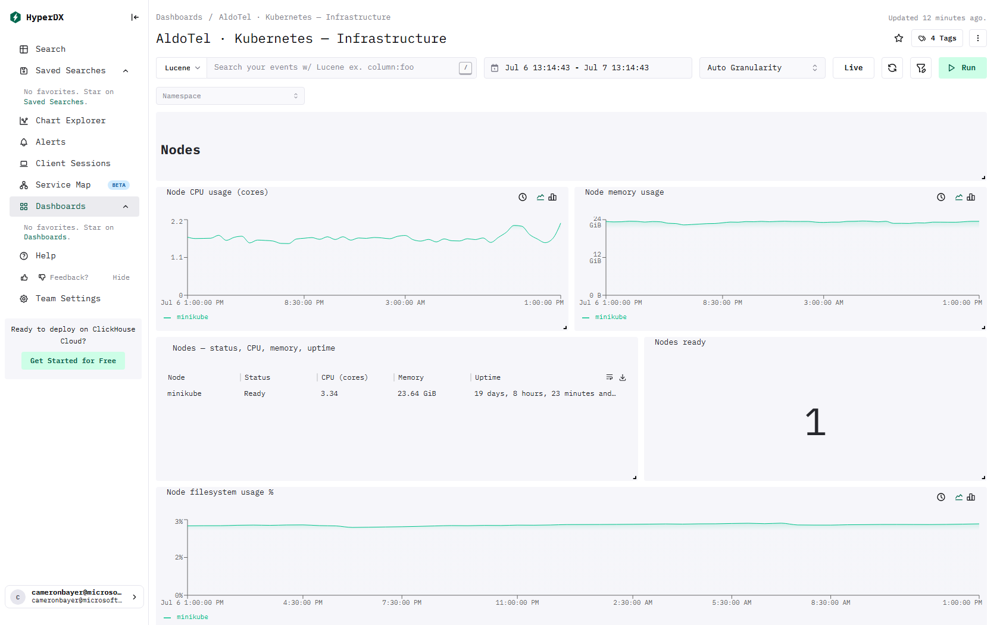

# ClickStack - Kubernetes - Infrastructure

> This page lists the ClickHouse tables and columns behind every visual on the dashboard.

[← Reference index](README.md) · [Dashboard catalog](../DASHBOARD-CATALOG.md) · [Deep dive](../DASHBOARD-DEEP-DIVE.md) · [HyperDX install guide](../README.md)

- **Template:** `dashboards/kubernetes-infrastructure.json` · tag `tmpl:k8s-infrastructure`
- **Data required:** kubeletstats receiver; k8s_cluster receiver; k8sobjects receiver (events.k8s.io) for the cluster-events tiles

## Preview



_Live capture from a ClickStack install with the OpenTelemetry demo flowing._

## Dashboard filters

These apply to every compatible tile on the dashboard.

| Filter | Column / expression | Source |
|---|---|---|
| Namespace | `ResourceAttributes['k8s.namespace.name']` | Metrics (`default.otel_metrics_{gauge|sum|histogram}`) |

## Kubernetes infrastructure health
Node, pod, namespace, and container health from the OpenTelemetry **kubeletstats** receiver, plus cluster events from the **k8sobjects** receiver. Use the **Namespace** filter and time range — note that node and cluster-event tiles are always cluster-wide. Start with node readiness, pods not running, container restarts, saturation, and warning events.

## Nodes
Per-node CPU, memory, filesystem, and readiness. The CPU (cores) and memory values are absolute usage, not percentages — compare them against each node's allocatable capacity. Investigate filesystem usage above ~80% (critical above ~90%).

### Node CPU usage (cores; vs allocatable) — line · Raw SQL

- **Tables:** `default.otel_metrics_gauge`

<details><summary>SQL query</summary>

```sql
SELECT
  toStartOfInterval(TimeUnix, INTERVAL {intervalSeconds:Int64} SECOND) AS ts,
  ResourceAttributes['k8s.node.name'] AS node,
  avg(Value) AS "CPU (cores)"
FROM default.otel_metrics_gauge
WHERE TimeUnix >= fromUnixTimestamp64Milli({startDateMilliseconds:Int64})
    AND TimeUnix <= fromUnixTimestamp64Milli({endDateMilliseconds:Int64})
    AND MetricName = 'k8s.node.cpu.usage'
GROUP BY ts, node
ORDER BY ts
```

</details>

### Node memory used (vs allocatable) — line · Raw SQL

- **Tables:** `default.otel_metrics_gauge`

<details><summary>SQL query</summary>

```sql
SELECT
  toStartOfInterval(TimeUnix, INTERVAL {intervalSeconds:Int64} SECOND) AS ts,
  ResourceAttributes['k8s.node.name'] AS node,
  avg(Value) AS "Memory"
FROM default.otel_metrics_gauge
WHERE TimeUnix >= fromUnixTimestamp64Milli({startDateMilliseconds:Int64})
    AND TimeUnix <= fromUnixTimestamp64Milli({endDateMilliseconds:Int64})
    AND MetricName = 'k8s.node.memory.usage'
GROUP BY ts, node
ORDER BY ts
```

</details>

### Nodes - status, CPU, memory, uptime — table · Raw SQL

- **Tables:** `default.otel_metrics_gauge`, `default.otel_metrics_sum`

<details><summary>SQL query</summary>

```sql
WITH g AS (
  SELECT ResourceAttributes['k8s.node.name'] AS node,
    argMaxIf(Value, TimeUnix, MetricName = 'k8s.node.condition_ready') AS ready,
    argMaxIf(Value, TimeUnix, MetricName = 'k8s.node.cpu.usage') AS cpu,
    argMaxIf(Value, TimeUnix, MetricName = 'k8s.node.memory.usage') AS mem
  FROM default.otel_metrics_gauge
  WHERE TimeUnix > now() - INTERVAL 1 HOUR
    AND MetricName IN ('k8s.node.condition_ready', 'k8s.node.cpu.usage', 'k8s.node.memory.usage')
  GROUP BY node
),
s AS (
  SELECT ResourceAttributes['k8s.node.name'] AS node, argMax(Value, TimeUnix) AS uptime
  FROM default.otel_metrics_sum
  WHERE TimeUnix > now() - INTERVAL 1 HOUR AND MetricName = 'k8s.node.uptime'
  GROUP BY node
)
SELECT g.node AS Node,
  if(g.ready = 1, 'Ready', 'Not Ready') AS Status,
  round(g.cpu, 2) AS "CPU (cores)",
  formatReadableSize(g.mem) AS Memory,
  formatReadableTimeDelta(toUInt64(s.uptime)) AS Uptime
FROM g LEFT JOIN s USING (node)
ORDER BY g.cpu DESC
```

</details>

### Kubernetes nodes ready % — number · Raw SQL

- **Tables:** `default.otel_metrics_gauge`

<details><summary>SQL query</summary>

```sql
SELECT if(total = 0, 0, ready / total) AS "Nodes ready" FROM (
  SELECT countIf(ready = 1) AS ready, count() AS total FROM (
    SELECT ResourceAttributes['k8s.node.name'] AS node, argMax(Value, TimeUnix) AS ready
    FROM default.otel_metrics_gauge
    WHERE TimeUnix >= fromUnixTimestamp64Milli({startDateMilliseconds:Int64})
      AND TimeUnix <= fromUnixTimestamp64Milli({endDateMilliseconds:Int64})
      AND MetricName = 'k8s.node.condition_ready'
    GROUP BY node
  )
)
```

</details>

### Node filesystem usage % — line · Raw SQL

- **Tables:** `default.otel_metrics_gauge`

<details><summary>SQL query</summary>

```sql
SELECT ts, node, usage / capacity AS "Filesystem" FROM (
  SELECT toStartOfInterval(TimeUnix, INTERVAL {intervalSeconds:Int64} SECOND) AS ts,
    ResourceAttributes['k8s.node.name'] AS node,
    avgIf(Value, MetricName = 'k8s.node.filesystem.usage') AS usage,
    avgIf(Value, MetricName = 'k8s.node.filesystem.capacity') AS capacity
  FROM default.otel_metrics_gauge
  WHERE TimeUnix >= fromUnixTimestamp64Milli({startDateMilliseconds:Int64})
    AND TimeUnix <= fromUnixTimestamp64Milli({endDateMilliseconds:Int64})
      AND MetricName IN ('k8s.node.filesystem.usage', 'k8s.node.filesystem.capacity')
  GROUP BY ts, node
) WHERE capacity > 0 ORDER BY ts
```

</details>

## Pods
Pod phase, deployment availability, and per-pod usage against configured limits. **Deployment availability** = ready ÷ desired replicas; below 100% means some replicas are unavailable. Sustained pod CPU/memory near 100% of its limit risks throttling or OOM (out-of-memory) kills.

### Deployment availability (ready / desired) — line

- **Source / table:** Metrics → `default.otel_metrics_gauge`
- **Metric(s):** `k8s.deployment.available`, `k8s.deployment.desired`  (column `MetricName`)
- **Measure(s):** last_value(`Value`) as `available`; last_value(`Value`) as `desired`
- **Group by:** `concat(ResourceAttributes['k8s.namespace.name'], '/', ResourceAttributes['k8s.deployment.name'])`
- **Columns used:** `ResourceAttributes['k8s.namespace.name']`, `ResourceAttributes['k8s.deployment.name']`, `Value`, `MetricName`, `TimeUnix`

### Pods by phase (count) — table · Raw SQL

- **Tables:** `default.otel_metrics_gauge`

<details><summary>SQL query</summary>

```sql
SELECT multiIf(phase = 1, 'Pending', phase = 2, 'Running', phase = 3, 'Succeeded', phase = 4, 'Failed', 'Unknown') AS "Phase", count() AS "Pods" FROM (
  SELECT ResourceAttributes['k8s.pod.name'] AS pod, argMax(Value, TimeUnix) AS phase
  FROM default.otel_metrics_gauge
  WHERE TimeUnix >= fromUnixTimestamp64Milli({startDateMilliseconds:Int64})
    AND TimeUnix <= fromUnixTimestamp64Milli({endDateMilliseconds:Int64})
    AND MetricName = 'k8s.pod.phase' AND $__filters
  GROUP BY pod
)
GROUP BY phase
ORDER BY count() DESC
```

</details>

### Pods - status & resources — table · Raw SQL

- **Tables:** `default.otel_metrics_gauge`, `default.otel_metrics_sum`

<details><summary>SQL query</summary>

```sql
WITH g AS (
  SELECT ResourceAttributes['k8s.pod.name'] AS pod,
    any(ResourceAttributes['k8s.namespace.name']) AS ns,
    argMaxIf(Value, TimeUnix, MetricName = 'k8s.pod.phase') AS phase,
    argMaxIf(Value, TimeUnix, MetricName = 'k8s.pod.cpu_limit_utilization') AS cpu_lim,
    argMaxIf(Value, TimeUnix, MetricName = 'k8s.pod.memory_limit_utilization') AS mem_lim,
    argMaxIf(Value, TimeUnix, MetricName = 'k8s.pod.memory.usage') AS mem,
    maxIf(Value, MetricName = 'k8s.container.restarts') AS restarts
  FROM default.otel_metrics_gauge
  WHERE TimeUnix > now() - INTERVAL 1 HOUR
    AND MetricName IN ('k8s.pod.phase', 'k8s.pod.cpu_limit_utilization', 'k8s.pod.memory_limit_utilization', 'k8s.pod.memory.usage', 'k8s.container.restarts')
    AND $__filters
  GROUP BY pod
),
s AS (
  SELECT ResourceAttributes['k8s.pod.name'] AS pod, argMax(Value, TimeUnix) AS uptime
  FROM default.otel_metrics_sum
  WHERE TimeUnix > now() - INTERVAL 1 HOUR AND MetricName = 'k8s.pod.uptime'
  GROUP BY pod
)
SELECT g.ns AS Namespace,
  g.pod AS Pod,
  multiIf(g.phase = 1, 'Pending', g.phase = 2, 'Running', g.phase = 3, 'Succeeded', g.phase = 4, 'Failed', 'Unknown') AS Status,
  if(isNaN(g.cpu_lim), '-', concat(toString(round(g.cpu_lim * 100, 1)), '%')) AS "CPU/limit",
  if(isNaN(g.mem_lim), '-', concat(toString(round(g.mem_lim * 100, 1)), '%')) AS "Mem/limit",
  formatReadableSize(g.mem) AS Memory,
  formatReadableTimeDelta(toUInt64(s.uptime)) AS Age,
  toUInt64(g.restarts) AS Restarts
FROM g LEFT JOIN s USING (pod)
ORDER BY g.restarts DESC, g.cpu_lim DESC
LIMIT 100
```

</details>

### Pod CPU vs limit % — line

- **Source / table:** Metrics → `default.otel_metrics_gauge`
- **Metric(s):** `k8s.pod.cpu_limit_utilization`  (column `MetricName`)
- **Measure(s):** max(`Value`) as `cpu vs limit`
- **Group by:** `ResourceAttributes['k8s.pod.name']`
- **Columns used:** `ResourceAttributes['k8s.pod.name']`, `Value`, `MetricName`, `TimeUnix`

### Pod memory vs limit % — line

- **Source / table:** Metrics → `default.otel_metrics_gauge`
- **Metric(s):** `k8s.pod.memory_limit_utilization`  (column `MetricName`)
- **Measure(s):** max(`Value`) as `mem vs limit`
- **Group by:** `ResourceAttributes['k8s.pod.name']`
- **Columns used:** `ResourceAttributes['k8s.pod.name']`, `Value`, `MetricName`, `TimeUnix`

## Namespaces
CPU and memory aggregated per namespace, with namespace phase (Active / Terminating).

### Namespace CPU usage (cores) — line · Raw SQL

- **Tables:** `default.otel_metrics_gauge`

<details><summary>SQL query</summary>

```sql
SELECT ts, ns, sum(pod_cpu) AS "CPU (cores)" FROM (
  SELECT toStartOfInterval(TimeUnix, INTERVAL {intervalSeconds:Int64} SECOND) AS ts,
         ResourceAttributes['k8s.namespace.name'] AS ns,
         ResourceAttributes['k8s.pod.name'] AS pod,
         avg(Value) AS pod_cpu
  FROM default.otel_metrics_gauge
  WHERE TimeUnix >= fromUnixTimestamp64Milli({startDateMilliseconds:Int64})
    AND TimeUnix <= fromUnixTimestamp64Milli({endDateMilliseconds:Int64})
    AND MetricName = 'k8s.pod.cpu.usage' AND $__filters
  GROUP BY ts, ns, pod
)
GROUP BY ts, ns
ORDER BY ts
```

</details>

### Namespace memory usage — line · Raw SQL

- **Tables:** `default.otel_metrics_gauge`

<details><summary>SQL query</summary>

```sql
SELECT ts, ns, sum(pod_mem) AS "Memory" FROM (
  SELECT toStartOfInterval(TimeUnix, INTERVAL {intervalSeconds:Int64} SECOND) AS ts,
         ResourceAttributes['k8s.namespace.name'] AS ns,
         ResourceAttributes['k8s.pod.name'] AS pod,
         avg(Value) AS pod_mem
  FROM default.otel_metrics_gauge
  WHERE TimeUnix >= fromUnixTimestamp64Milli({startDateMilliseconds:Int64})
    AND TimeUnix <= fromUnixTimestamp64Milli({endDateMilliseconds:Int64})
    AND MetricName = 'k8s.pod.memory.usage' AND $__filters
  GROUP BY ts, ns, pod
)
GROUP BY ts, ns
ORDER BY ts
```

</details>

### Namespaces - phase, CPU, memory — table · Raw SQL

- **Tables:** `default.otel_metrics_gauge`

<details><summary>SQL query</summary>

```sql
WITH pods AS (
  SELECT ResourceAttributes['k8s.namespace.name'] AS ns,
    ResourceAttributes['k8s.pod.name'] AS pod,
    argMaxIf(Value, TimeUnix, MetricName = 'k8s.pod.cpu.usage') AS cpu,
    argMaxIf(Value, TimeUnix, MetricName = 'k8s.pod.memory.usage') AS mem
  FROM default.otel_metrics_gauge
  WHERE TimeUnix > now() - INTERVAL 1 HOUR
    AND MetricName IN ('k8s.pod.cpu.usage', 'k8s.pod.memory.usage')
    AND $__filters
  GROUP BY ns, pod
),
agg AS ( SELECT ns, sum(cpu) AS cpu, sum(mem) AS mem FROM pods GROUP BY ns ),
ph AS (
  SELECT ResourceAttributes['k8s.namespace.name'] AS ns, argMax(Value, TimeUnix) AS phase
  FROM default.otel_metrics_gauge
  WHERE TimeUnix > now() - INTERVAL 1 HOUR AND MetricName = 'k8s.namespace.phase'
  GROUP BY ns
)
SELECT agg.ns AS Namespace,
  multiIf(ph.phase = 1, 'Active', ph.phase = 2, 'Terminating', 'Unknown') AS Phase,
  round(agg.cpu, 2) AS "CPU (cores)",
  formatReadableSize(agg.mem) AS Memory
FROM agg LEFT JOIN ph USING (ns)
ORDER BY agg.cpu DESC
```

</details>

## Saturation & restarts
Cluster-wide health signals. **Saturation** is how close a resource is to exhaustion (e.g. node memory used ÷ total). Watch for pods not Running, new container restarts, and node memory saturation above ~85% (critical above ~95%).

### Pods not Running — number · Raw SQL

- **Tables:** `default.otel_metrics_gauge`

<details><summary>SQL query</summary>

```sql
SELECT countIf(phase NOT IN (2, 3)) AS "Not running" FROM (
  SELECT ResourceAttributes['k8s.pod.name'] AS pod, argMax(Value, TimeUnix) AS phase
  FROM default.otel_metrics_gauge
  WHERE TimeUnix >= fromUnixTimestamp64Milli({startDateMilliseconds:Int64})
    AND TimeUnix <= fromUnixTimestamp64Milli({endDateMilliseconds:Int64})
    AND MetricName = 'k8s.pod.phase' AND $__filters
  GROUP BY pod
)
```

</details>

### Container restarts (selected range) — number · Raw SQL

- **Tables:** `default.otel_metrics_gauge`

<details><summary>SQL query</summary>

```sql
SELECT sum(d) AS "New restarts" FROM (
  SELECT max(Value) - min(Value) AS d
  FROM default.otel_metrics_gauge
  WHERE TimeUnix >= fromUnixTimestamp64Milli({startDateMilliseconds:Int64})
    AND TimeUnix <= fromUnixTimestamp64Milli({endDateMilliseconds:Int64})
    AND MetricName = 'k8s.container.restarts' AND $__filters
  GROUP BY ResourceAttributes['k8s.pod.name']
)
```

</details>

### Node memory saturation % — number · Raw SQL

- **Tables:** `default.otel_metrics_gauge`

<details><summary>SQL query</summary>

```sql
SELECT max(sat) AS "Node mem saturation" FROM (
  SELECT ResourceAttributes['k8s.node.name'] AS node,
         argMaxIf(Value, TimeUnix, MetricName = 'k8s.node.memory.usage') /
         nullIf(argMaxIf(Value, TimeUnix, MetricName = 'k8s.node.memory.usage') + argMaxIf(Value, TimeUnix, MetricName = 'k8s.node.memory.available'), 0) AS sat
  FROM default.otel_metrics_gauge
  WHERE TimeUnix >= fromUnixTimestamp64Milli({startDateMilliseconds:Int64})
    AND TimeUnix <= fromUnixTimestamp64Milli({endDateMilliseconds:Int64})
    AND MetricName IN ('k8s.node.memory.usage', 'k8s.node.memory.available')
  GROUP BY node
)
```

</details>

### Top pods by restarts — table · Raw SQL

- **Tables:** `default.otel_metrics_gauge`

<details><summary>SQL query</summary>

```sql
SELECT ns AS "Namespace", pod AS "Pod", toUInt64(restarts) AS "Restarts" FROM (
  SELECT ResourceAttributes['k8s.namespace.name'] AS ns,
         ResourceAttributes['k8s.pod.name'] AS pod,
         argMax(Value, TimeUnix) AS restarts
  FROM default.otel_metrics_gauge
  WHERE TimeUnix >= fromUnixTimestamp64Milli({startDateMilliseconds:Int64})
    AND TimeUnix <= fromUnixTimestamp64Milli({endDateMilliseconds:Int64})
    AND MetricName = 'k8s.container.restarts' AND $__filters
  GROUP BY ns, pod
)
WHERE restarts > 0
ORDER BY restarts DESC
LIMIT 50
```

</details>

## Container utilization
Per-container usage as a fraction of its configured CPU/memory **limit** and **request** (`k8s.container.*_utilization` from kubeletstats). Sustained values near 100% of limit risk CPU throttling or OOM (out-of-memory) termination.

### Container CPU vs limit % — line · Raw SQL

- **Tables:** `default.otel_metrics_gauge`

<details><summary>SQL query</summary>

```sql
SELECT toStartOfInterval(TimeUnix, INTERVAL {intervalSeconds:Int64} SECOND) AS ts,
       concat(ResourceAttributes['k8s.namespace.name'], '/', ResourceAttributes['k8s.pod.name'], '/', ResourceAttributes['k8s.container.name']) AS container,
       avg(Value) AS "CPU vs limit"
FROM default.otel_metrics_gauge
WHERE TimeUnix >= fromUnixTimestamp64Milli({startDateMilliseconds:Int64})
    AND TimeUnix <= fromUnixTimestamp64Milli({endDateMilliseconds:Int64})
    AND MetricName = 'k8s.container.cpu_limit_utilization' AND $__filters
GROUP BY ts, container
ORDER BY ts
```

</details>

### Container memory vs limit % — line · Raw SQL

- **Tables:** `default.otel_metrics_gauge`

<details><summary>SQL query</summary>

```sql
SELECT toStartOfInterval(TimeUnix, INTERVAL {intervalSeconds:Int64} SECOND) AS ts,
       concat(ResourceAttributes['k8s.namespace.name'], '/', ResourceAttributes['k8s.pod.name'], '/', ResourceAttributes['k8s.container.name']) AS container,
       avg(Value) AS "Mem vs limit"
FROM default.otel_metrics_gauge
WHERE TimeUnix >= fromUnixTimestamp64Milli({startDateMilliseconds:Int64})
    AND TimeUnix <= fromUnixTimestamp64Milli({endDateMilliseconds:Int64})
    AND MetricName = 'k8s.container.memory_limit_utilization' AND $__filters
GROUP BY ts, container
ORDER BY ts
```

</details>

### Containers - utilization vs limit / request — table · Raw SQL

- **Tables:** `default.otel_metrics_gauge`, `default.otel_metrics_sum`

<details><summary>SQL query</summary>

```sql
WITH g AS (
  SELECT ResourceAttributes['k8s.namespace.name'] AS ns,
    ResourceAttributes['k8s.pod.name'] AS pod,
    ResourceAttributes['k8s.container.name'] AS container,
    argMaxIf(Value, TimeUnix, MetricName = 'k8s.container.cpu_limit_utilization') AS cpu_lim,
    argMaxIf(Value, TimeUnix, MetricName = 'k8s.container.cpu_request_utilization') AS cpu_req,
    argMaxIf(Value, TimeUnix, MetricName = 'k8s.container.memory_limit_utilization') AS mem_lim,
    argMaxIf(Value, TimeUnix, MetricName = 'k8s.container.memory_request_utilization') AS mem_req
  FROM default.otel_metrics_gauge
  WHERE TimeUnix > now() - INTERVAL 1 HOUR
    AND MetricName IN ('k8s.container.cpu_limit_utilization', 'k8s.container.cpu_request_utilization', 'k8s.container.memory_limit_utilization', 'k8s.container.memory_request_utilization')
    AND $__filters
  GROUP BY ns, pod, container
),
u AS (
  SELECT ResourceAttributes['k8s.namespace.name'] AS ns, ResourceAttributes['k8s.pod.name'] AS pod,
    ResourceAttributes['k8s.container.name'] AS container, argMax(Value, TimeUnix) AS uptime
  FROM default.otel_metrics_sum
  WHERE TimeUnix > now() - INTERVAL 1 HOUR AND MetricName = 'container.uptime'
  GROUP BY ns, pod, container
)
SELECT g.ns AS Namespace, g.pod AS Pod, g.container AS Container,
  if(isNaN(g.cpu_lim), '-', concat(toString(round(g.cpu_lim * 100, 1)), '%')) AS "CPU/limit",
  if(isNaN(g.cpu_req), '-', concat(toString(round(g.cpu_req * 100, 1)), '%')) AS "CPU/request",
  if(isNaN(g.mem_lim), '-', concat(toString(round(g.mem_lim * 100, 1)), '%')) AS "Mem/limit",
  if(isNaN(g.mem_req), '-', concat(toString(round(g.mem_req * 100, 1)), '%')) AS "Mem/request",
  if(u.uptime > 0, formatReadableTimeDelta(toUInt64(u.uptime)), '-') AS Uptime
FROM g LEFT JOIN u USING (ns, pod, container)
ORDER BY g.cpu_lim DESC
LIMIT 100
```

</details>

## Cluster events
Kubernetes events collected by the k8sobjects receiver (`events.k8s.io`), stored as logs. Cluster-wide (not scoped by the Namespace filter above).

### Warning events (in range) — number · Raw SQL

- **Tables:** `default.otel_logs`

<details><summary>SQL query</summary>

```sql
SELECT countIf(JSONExtractString(Body, 'object', 'type') = 'Warning') AS "Warning events"
FROM default.otel_logs
WHERE Timestamp >= fromUnixTimestamp64Milli({startDateMilliseconds:Int64})
    AND Timestamp <= fromUnixTimestamp64Milli({endDateMilliseconds:Int64})
    AND ScopeName LIKE '%k8sobjectsreceiver%'
```

</details>

### Top event reasons — table · Raw SQL

- **Tables:** `default.otel_logs`

<details><summary>SQL query</summary>

```sql
SELECT JSONExtractString(Body, 'object', 'reason') AS "Reason",
  JSONExtractString(Body, 'object', 'type') AS "Type",
  count() AS "Count"
FROM default.otel_logs
WHERE Timestamp >= fromUnixTimestamp64Milli({startDateMilliseconds:Int64})
    AND Timestamp <= fromUnixTimestamp64Milli({endDateMilliseconds:Int64})
    AND ScopeName LIKE '%k8sobjectsreceiver%'
GROUP BY Reason, Type
ORDER BY Count DESC
LIMIT 50
```

</details>

### Recent events — table · Raw SQL

- **Tables:** `default.otel_logs`

<details><summary>SQL query</summary>

```sql
SELECT Timestamp AS "Time",
  JSONExtractString(Body, 'object', 'type') AS "Type",
  JSONExtractString(Body, 'object', 'reason') AS "Reason",
  concat(JSONExtractString(Body, 'object', 'regarding', 'kind'), ' ', JSONExtractString(Body, 'object', 'regarding', 'namespace'), '/', JSONExtractString(Body, 'object', 'regarding', 'name')) AS "Object",
  substring(JSONExtractString(Body, 'object', 'note'), 1, 160) AS "Message"
FROM default.otel_logs
WHERE Timestamp >= fromUnixTimestamp64Milli({startDateMilliseconds:Int64})
    AND Timestamp <= fromUnixTimestamp64Milli({endDateMilliseconds:Int64})
    AND ScopeName LIKE '%k8sobjectsreceiver%'
ORDER BY Timestamp DESC
LIMIT 200
```

</details>
